# M57-Jean - Exfiltration de données

L'objectif de ce TP est de trouver dans l'image disque de Jean les 3 informations suivantes:

1. Quand es-ce que Jean à crée la feuille de calcul ?
2. Comment l'information est-elle passée de son ordinateur au site web du concurrent ?
3. Qui d'autre dans l'entreprise est impliqué ?

## Installation des outils nécessaires

Dans un premier temps, afin de réaliser l'exfiltration des données et répondre aux questions précédentes ils faut installer autopsy qui nous permettra de réaliser ce dont nous avons besoin.

### Récupération et installation des pré-requis

```bash
wget https://raw.githubusercontent.com/sleuthkit/autopsy/develop/linux_macos_install_scripts/install_prereqs_ubuntu.sh
./install_prereqs_ubuntu.sh
```

### Installation de The Sleuth Kit

On récupère le paquet débian disponible depuis le nextcloud et on l'installe:

```bash
sudo apt update && sudo apt install /tmp/sleuthkit-java_4.12.1-1_amd64.deb 
```

### Installation d'Autopsy

J'ai récupérer l'archive zip d'autopsy sur le nextcloud, il faut aussi récupérer le script d'installation sur le github d'autopsy:

```bash
# Récupération du script d'installation
wget https://raw.githubusercontent.com/sleuthkit/autopsy/develop/linux_macos_install_scripts/install_application.sh

./install_application.sh -z autopsy-4.21.0.zip -i ~/autopsy -j /usr/lib/jvm/java-17-openjdk-amd64
```

Une fois l'installation d'autopsy installé on peut commencer à examiner le disque dur.

<br>
<br>

## Analyse du disque dur de Jean

On lance autopsy (depuis le répertoire où ce dernier a été installé):

```bash
./autopsy --no-splash
```

Ensuite, on crée une nouvelle enquête
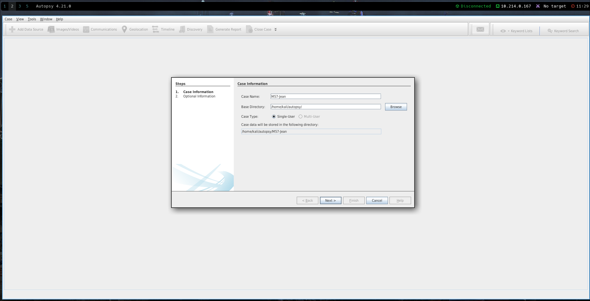

On arrive sur la page suivante
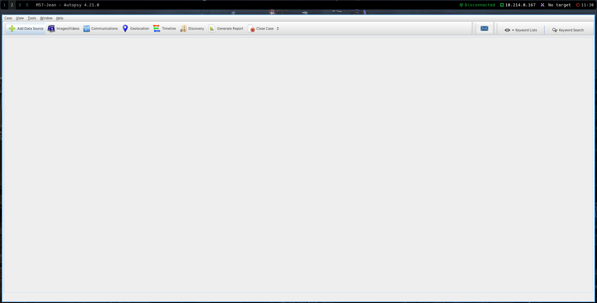

On clique en haut à gauche pour ajouter l'image disque sur "Add Data Source"

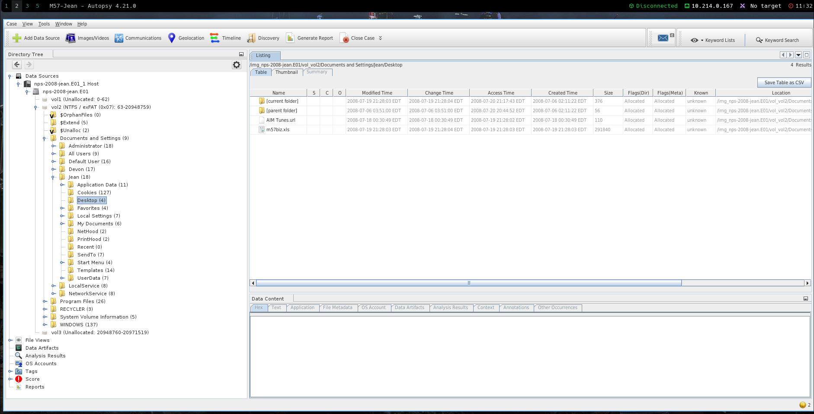

L'image disque a bien été chargée, on peut passer à l'analyse des données.

## 1. Quand es-ce que Jean à crée la feuille de calcul ?

En me balandant dans les dossiers de l'images disque, j'arrive sur le bureau de Jean où la feuille de calcul est disponible.

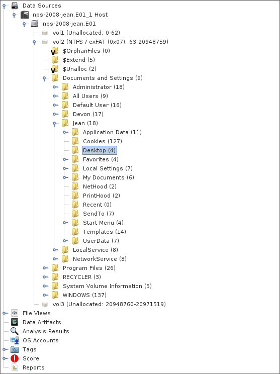

Pour avoir les informations temporelles du fichier on peut faire un clique droit et cliquer sur "View file in timeline" :

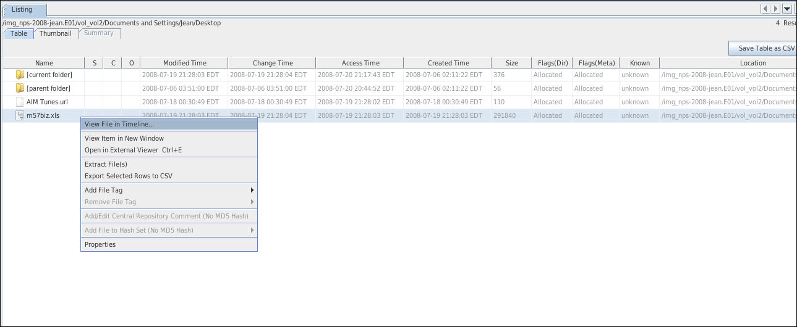

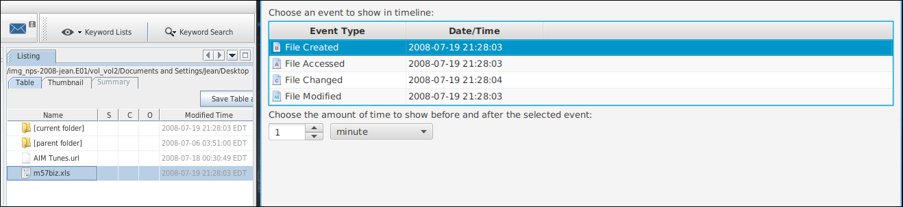

On peut donc noter que le fichier a été crée le **19 Juillet 2088**.

## 2. Comment l'information est-elle passée de son ordinateur au site web du concurrent ?

En se balandant dans les dossiers du disque de Jean, je trouve dans les données d'application un dossier "Outlook" contenant les emails envoyés et reçu par Jean :

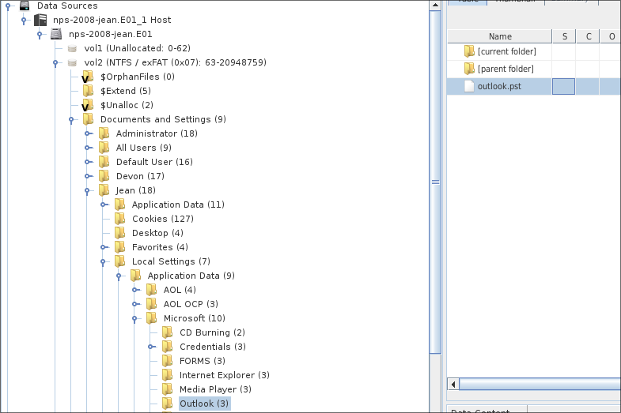

C'est un fichier .pst "Personal Storage Table" utilisé par Outlook, utilisant une machine sous Linux, je ne peux pas installer Outlook pour visualiser le contenu du fichier un faut donc trouver un logiciel pour l'ouvrir sous Linux.

### Exploitation du fichier outlook.pst

Dans une premier temps, il faut extraire le fichier vers la machine linux:

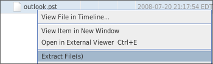

Une fois le fichier extrait sur ma machine, j'installe le logiciel **evolution** qui me permet de lire ce type de fichier sous Linux.

```bash
sudo apt install evolution evolution-plugins
```

Une fois le fichier chargé, je remarque qu'il y a de nombreux mail d'alertes Google qui envoie un mail à Jean quand du contenu est susceptible de l'interessés sur Internet. Après vérification aucun de ces mails ne contient de phising. Il y a également quelques mail de newsletter dans sa boîte de réception.

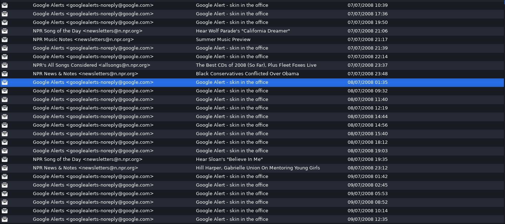

Après avoir enlevés ces mails, il ne reste plus que les mails de Jean avec les autres membres de la société.

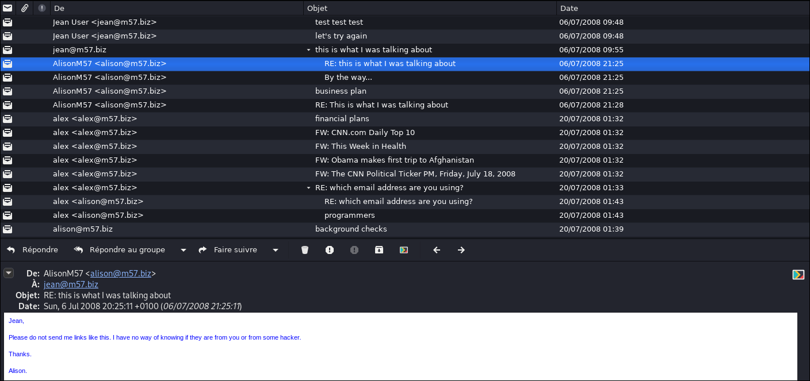

On remarque un mail d'Alison demandant à Jean de lui envoyer la feuille de calcul, elle qui disait pourtant "n'avoir jamais demandé à Jean cette feuille de calcul". 

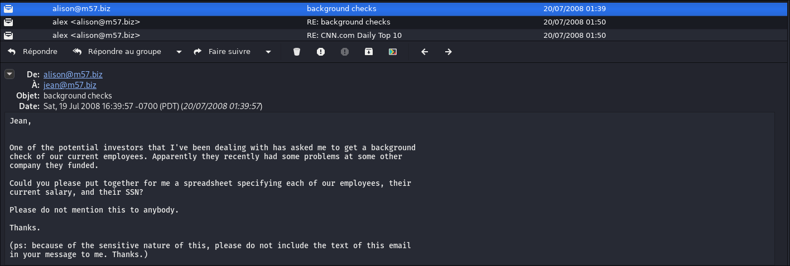

On peut donc penser que soit Alison a menti ou alors son identité à été usurpé.

Dans le mail où Jean envoie la feuille de calcul, on remarque que l'identité d'Alison à été usurpé depuis le début:

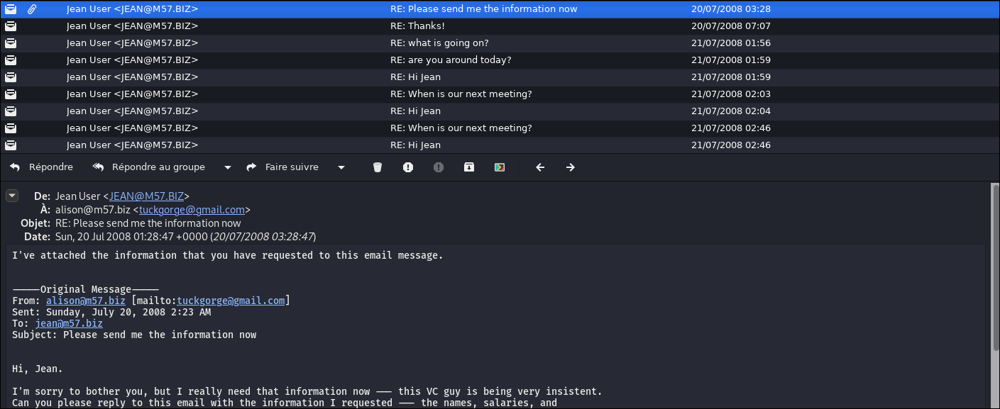

En effet, on remarque que le destinataire de l'email est ```alison\@m57.biz <tuckgorge\@gmail.com> ``` ce qui signifie que Jean parle en fait avec un certain tuckgorge\@gmail.com et cette personne à récupérer la feuille de calcul en changenant son nom par l'email d'Alison. Jean pensait donc qu'il parlait à Alision mais ce n'est pas le cas.


Jean à reçu 2 mails avec l'adresse email usurpé d'Alison est ne s'est pas rendu compte du problème.

On peut donc penser que si la feuille de calcul s'est retrouvé chez un concurrent, c'est à cause dun certain tuckgorge\@gmail.com qui a peut-être revendu la feuille de calcul ou bien fait partie du groupe concurrent.

## 3. Qui d'autre dans l'entreprise est impliqué ?

Personne d'autres dans l'entreprise n'est impliqué, l'identité d'Alison à été usurpé dans le but de récupérer des informations confidentielles sur les autres employés de la boîte, en l'occurence ici Jean. 