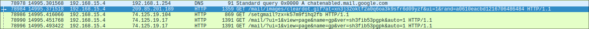

# Harcèlement à Nitroba

L'objectif de ce TP est de trouver qui envoie des mails offensif à l'enseignante Lily Tuckrige.

Afin de résoudre ce problème je vais suivre les étapes suivantes:

1. Établir la carte du réseau de la chambre des étudiants à Nitroba.
2. Trouver qui a envoyer le mail à lilytuckrige\@yahoo.com
3. Identifier l'autre connexion TCP qui appartient à l'attaquant.
4. Trouver des informations dans l'une de ces connexions TCP afin d'identifier l'attaquant.

## 1. Établir la carte du réseau de la chambre des étudiants à Nitroba

On verifie avec l'IP trouver dans l'en-tête du mail Yahoo dans quels trame elle apparait:


On remarque que cette IP n'apparait que dans des échanges avec l'IP local 192.168.15.4 qui est surement l'IP local de l'attaquant.

On peut vérifier dans l'onglet Statistiques > Point de terminaisons toutes les adresses IP qui apparaissent dans cette capture avec le nombre de paquets qu'elles ont envoyés:


Il y a donc 5 machines connectés sur le réseau (192.168.15.1 est la gateway) mais on remarque que l'IP trouvé précedemment à envoyé beaucoup plus de paquets que les autres (73 197).

<br>
<br>

## 2. Trouver qui a envoyer le mail à lilytuckrige\@yahoo.com

On vient chercher dans les flux http qui à envoyé un mail à Lily pour ce faire j'utilise le filtre ```frame contains "lilytuckrige@yahoo.com"``` pour trouver dans les flux http l'email correspondant.


On trouve bien un mail, provenant de l'IP 192.168.15.4 comme trouvé ci-dessus. On peut voir dans le champ "HTML Form URL Encoded" l'email d'envoie qui est: ```the_whole_world_is_watching@nitroba.org```

Cet email ne nous aide pas beaucoup car il ne nous donne pas de réel identité sur l'attaquant.

En revanche, j'ai pu trouver des informations sur l'adresse MAC de l'attaquant dans l'en-tête ethernet.


L'adresse MAC de l'attaquant est 00:17:f2:e2:c0:ce, c'est une machine Apple qui est utilisé.

## 3. Identifier l'autre connexion TCP qui appartient à l'attaquant


L'attaquant a de nombreuses connexions TCP qui lui appartiennent cependant on peut rechercher uniquement celles qui sont relatives à des mails avec le filtre suivant:
```frame contains "mail"```


Il y a encore beaucoup de connexions TCP contenant du mail dans de l'HTTP.

## 4. Trouver des informations dans l'une de ces connexions TCP afin d'identifier l'attaquant

En naviguant dans les connexions HTTP, je remarque également les requêtes DNS passé par l'attaquant et particulièrement une requête vers **mail\.google.com** relative à l'utilisation de gmail.


Je vois de nombreux échanges suite à la requête DNS, mais je remarque avec le nombre important de requête sur "mail/html/load.html" qu'il s'agit de la page de chargement de gmail (avant d'arriver sur la boite mail), je n'ai pas trouvé de formulaire de connexion dans les trames suivantes. Cela peut signifier que l'utilisateur est deja connecté, il y a peut-être son adresse email stocké dans un cookie. Je continue de descendre dans les trames et je remarque une autre requêtes DNS vers les serveurs de mail de google mais cette fois-ci sur **chatenabled\.mail.google.com** je penses que c'est la requête envoyé une fois le chargement terminé.



En analysant le flux HTTP des trames suivant la requête DNS, je trouve un cookie nommé **gmailchat** qui contient une adresse mail:


L'adresse email est: ```jcoachj@gmail.com```

On regardant la liste des élèves fournie, un élève semble correspondre à cet email.


L'étudiant qui a envoyé tout ces mails à Lily Tuckrige est **Johnny Coach** dont l'email est ```jcoachj@gmail.com```.
