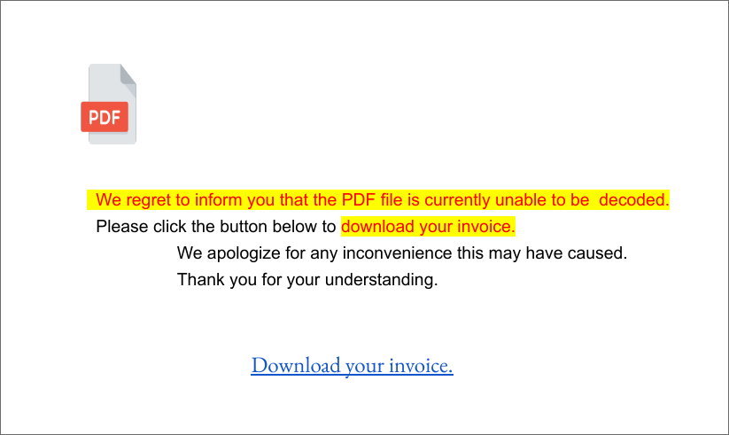
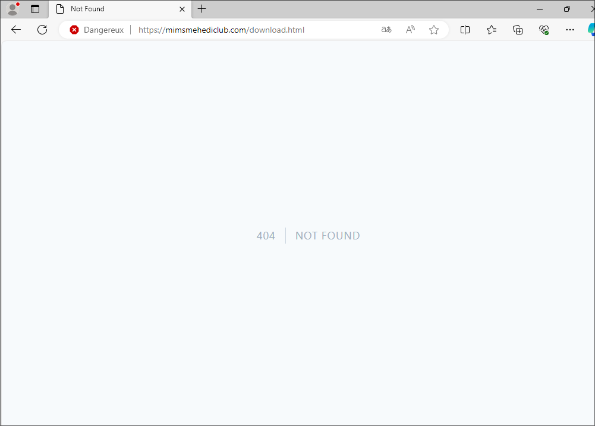
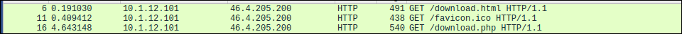
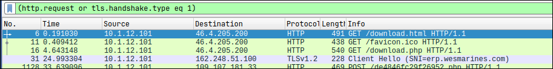
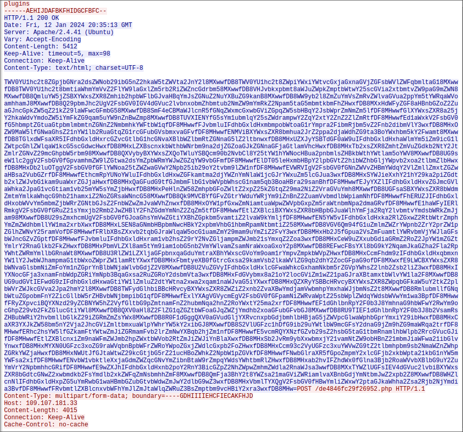
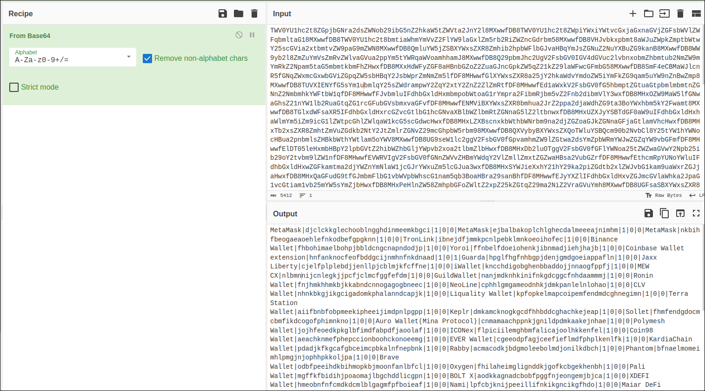
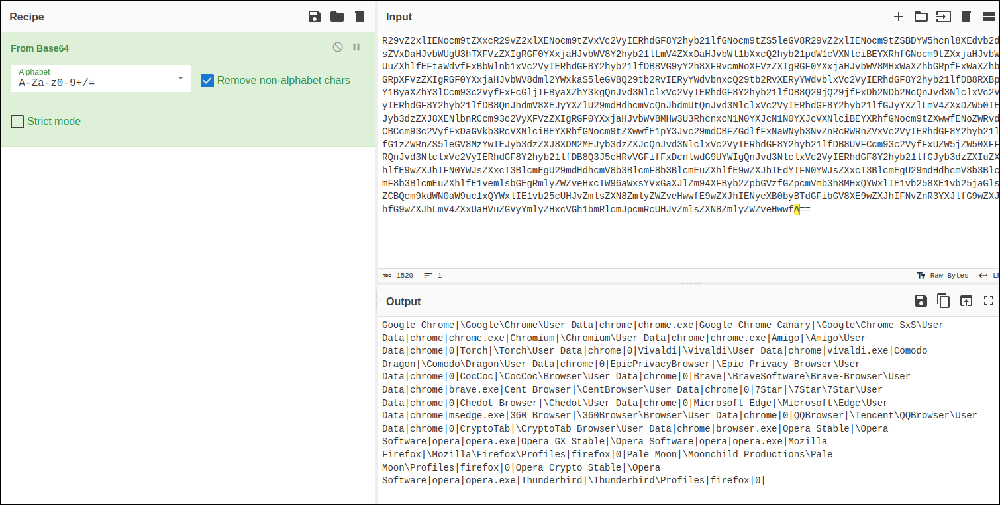
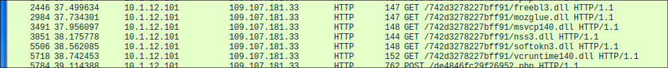

# Malware StealC

L'objectif de ce TP est de retracé étape par étape l'attaque avec le malware StealC

## 1. Envoie de mail

Dans un premier temps, l'attaquant va envoyer un mail à sa victimes concernant une facture à payé. Mais lorsque la victime ouvre le pdf contenant la "facture", c'est en fait un faux pdf qui ne peut soit disant "pas être décodé". Mais on retrouve quand même un lien pour télécharger la facture malgré tout.

## 2. Téléchargement du virus

Cependant, le lien contenu dans le pdf ne renvoie pas vers le téléchargement de la facture, mais vers le téléchargement du virus.

En cliquant sur le lien (dans une VM) on arrive sur une page bloqué par l'antivirus Windows par défaut mais en le désactivant on se rend compte qu'il n y a plus rien sur la page, on ne peut plus télécharger le virus. Je penses que les pirates utilise un autre site puisque celui-ci est bloqué par la plupart des antivirus.

On peut néanmoins, analysé la capture de trame fourni pour comprendre comment fonctionne le virus après son téléchargement.

## 3. Analyse de trame

On filtre tout d'abord uniquement les requêtes HTTP.

Dans un premier temps, le malware est télécharger depuis une requête HTTP sur la page /download.php.

De plus, en filtrant également les handshake TLS en plus des reqûetes HTTP on remarque qu'a la suite du téléchargement une connnexion sécurisé TLSv1.2 est ouverte vers un serveur distant. L'attaquant à donc un accès vers la machibe piraté.

On remarque ensuite qu'il y a de nombreuses requête de type POST qui sont enregistrés dans la capture, c'est de cette façon que les données sont volés par la malware.

En analysant les informations transmises dans le formulaire, on se rend compte que ces dernières sont encodé en Base64 que l'on peut décoder à l'aide de l'outil CyberChef:

Analyse dans Cyberchef:

Les informations décodés semblent d'être des Wallets de cyptomonnaie sur MetaMask par exemple. Il peut s'agir des données volées sur la machine.

Sur une autres requêtes POST on remarque l'envoie de données relatives à l'utilisation des navigateur internet:

Ce malware est un infostealer qui récupère les informations sur la machine attaqué et les envoies sur un serveur distant au attaquant ici.

Enfin, le virus télécharge ensuite plusieurs librairie en .dll qui viendront s'executer sur la machine cible.

Ces DLL peuvent servir à récupérer des informations plus spécifiques à des applications qui nécessitent ces librairies. Les programmes utiliseront donc les versions modifier de ces dernières à la place des versions originales.

En résumé, le virus est téléchargé, il ouvre une connexion TLSv1.2 vers le serveur **162.248.51.100**. Ensuite, des données sont envoyés encodé en base64 dans des requêtes POST sur le serveur **109.107.181.33** le même serveur d'ou le virus à été téléchargé. Pour finir, le virus vient télcharger plusieurs librairies DLL qui peuvent servir à obtenir plus d'informations sur des applications spécifiques que la victime utilise peut-être.

