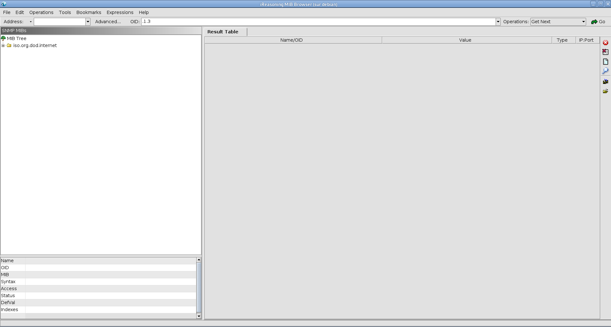
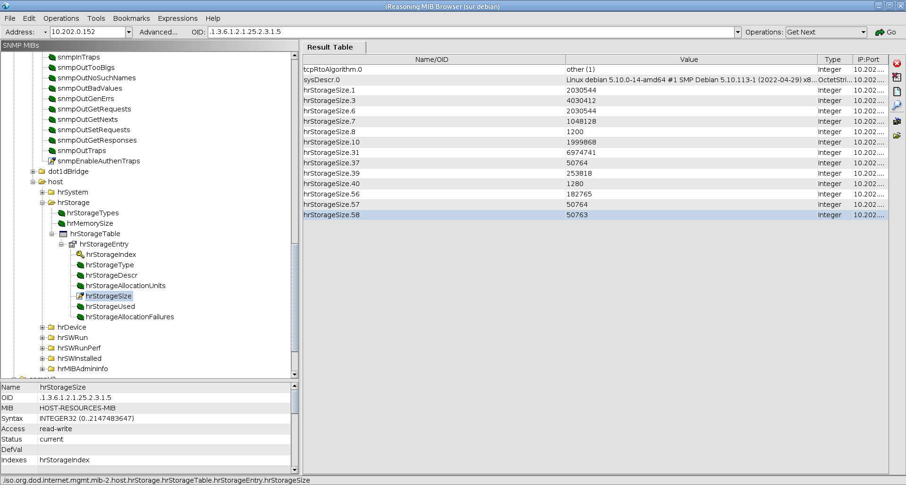
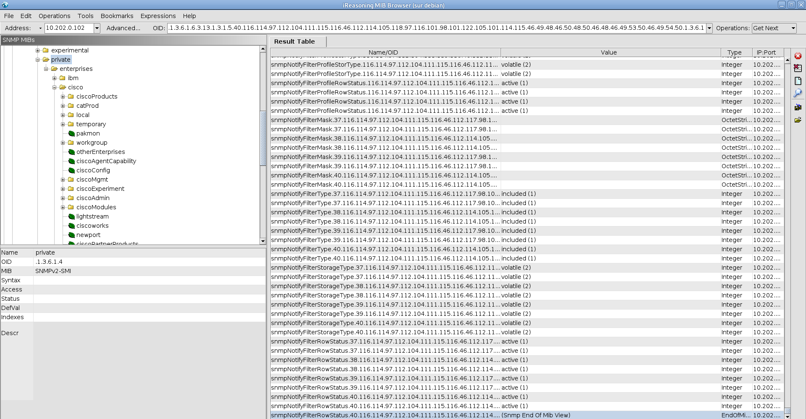

# R502 - TP - SNMP #

### 2. Interrogation d'un serveur avec Linux ###

- Mémoire totale de la machine
```bash
root@debian:~# snmpwalk -v 2c -c publicbeziers 127.0.0.1 1.3.6.1.4.1.2021.4.5
UCD-SNMP-MIB::memTotalReal.0 = INTEGER: 2030768 kB
```

- Uptime de la machine
```bash
root@debian:~# snmpwalk -v 2c -c publicbeziers 127.0.0.1 1.3.6.1.2.1.25.1.1
HOST-RESOURCES-MIB::hrSystemUptime.0 = Timeticks: (238454) 0:39:44.54
```

- Nombre de process de la machine
```bash
root@debian:~# snmpwalk -v 2c -c publicbeziers 127.0.0.1 1.3.6.1.2.1.25.1.6
HOST-RESOURCES-MIB::hrSystemProcesses.0 = Gauge32: 2
```

- L'espace de stockage utilisé sur la machine
```bash
root@debian:~# snmpwalk -v 2c -c publicbeziers 127.0.0.1 1.3.6.1.2.1.25.2.3.1.6.1
HOST-RESOURCES-MIB::hrStorageUsed.1 = INTEGER: 1877172
```

- Taille d'une unité d'allocation de stockage
```bash
root@debian:~# snmpwalk -v 2c -c publicbeziers 127.0.0.1 1.3.6.1.2.1.25.2.3.1.4.1
HOST-RESOURCES-MIB::hrStorageAllocationUnits.1 = INTEGER: 1024 Bytes
```

__snmptable:__  

- Afficher la table des interfaces réseaux
```bash
root@debian:~# snmptable -v2c -c publicbeziers localhost IF-MIB::ifTable
SNMP table: IF-MIB::ifTable

 ifIndex ifDescr           ifType ifMtu    ifSpeed  ifPhysAddress ifAdminStatus ifOperStatus ifLastChange ifInOctets ifInUcastPkts ifInNUcastPkts ifInDiscards ifInErrors ifInUnknownProtos ifOutOctets ifOutUcastPkts ifOutNUcastPkts ifOutDiscards ifOutErrors ifOutQLen              ifSpecific
       1      lo softwareLoopback 65536   10000000                           up           up 0:0:00:00.00       1720             8              0            0          0                 0        1720              8               0             0           0         0 SNMPv2-SMI::zeroDotZero
       6    eth0   ethernetCsmacd  1500 4294967295 2:42:ac:11:0:2            up           up 0:0:00:00.00     712400          7245              0            0          0                 0      749757           7228               0             0           0         0 SNMPv2-SMI::zeroDotZero
```

- Affiche la table des partitions
```bash
root@debian:~# snmptable -v2c -c publicbeziers localhost HOST-RESOURCES-MIB::hrPartitionTable
HOST-RESOURCES-MIB::hrPartitionTable: No entries
```

- Table des load average
```bash
root@debian:~# snmptable -v2c -c publicbeziers localhost UCD-SNMP-MIB::laTable
SNMP table: UCD-SNMP-MIB::laTable

 laIndex laNames laLoad laConfig laLoadInt laLoadFloat laErrorFlag laErrMessage
       1  Load-1   0.04    12.00         4    0.040000     noError
       2  Load-5   0.03    10.00         3    0.030000     noError
       3 Load-15   0.00     5.00         0    0.000000     noError
```

- Afficher la table des IO
```bash
root@b20efae1e564:/# snmptable -v2c -c publicbeziers 172.17.0.3 UCD-DISKIO-MIB::diskIOTable
SNMP table: UCD-DISKIO-MIB::diskIOTable

 diskIOIndex diskIODevice diskIONRead diskIONWritten diskIOReads diskIOWrites diskIOLA1 diskIOLA5 diskIOLA15 diskIONReadX diskIONWrittenX diskIOBusyTime
           1      nvme0n1  2750980096     2937402368       90364        45432         0         0          0   2750980096      2937402368              ?
           2    nvme0n1p1     8256512           5120         242            3         0         0          0      8256512            5120              ?
           3    nvme0n1p2  2737206272     2937397248       89926        44129         0         0          0   2737206272      2937397248              ?
           4    nvme0n1p3     3588096              0         109            0         0         0          0      3588096               0              ?
           5        loop0     1129472              0          78            0         0         0          0      1129472               0              ?
           6        loop1     1136640              0          75            0         0         0          0      1136640               0              ?
           7        loop2     1738752              0         343            0         0         0          0      1738752               0              ?
           8        loop3      952320              0         312            0         0         0          0       952320               0              ?
           9        loop4      974848              0         321            0         0         0          0       974848               0              ?
          10        loop5      936960              0         305            0         0         0          0       936960               0              ?
          11        loop6    23323648              0         968            0         0         0          0     23323648               0              ?
          12        loop7     1012736              0         338            0         0         0          0      1012736               0              ?
          13        loop8     2075648              0         554            0         0         0          0      2075648               0              ?
          14        loop9    14152704              0         419            0         0         0          0     14152704               0              ?
          15       loop10     1855488              0         396            0         0         0          0      1855488               0              ?
          16       loop11    17324032              0        1018            0         0         0          0     17324032               0              ?
          17       loop12    18576384              0         687            0         0         0          0     18576384               0              ?
          18       loop13    13441024              0        1031            0         0         0          0     13441024               0              ?
          19       loop14     1089536              0         419            0         0         0          0      1089536               0              ?
          20       loop15    23774208              0         702            0         0         0          0     23774208               0              ?
```

### 3. Installation d'un serveur SNMP ###

2. Affiche\.sh

```bash
root@debian:/usr/bin# cat affiche.sh 
#!/bin/bash
echo "$(date)\n" >> /tmp/montrap
```

- /etc/snmp/snmptrapd.conf edit
```bash
root@debian:/usr/bin# cat /etc/snmp/snmptrapd.conf 

#
# EXAMPLE-trap.conf:
#   An example configuration file for configuring the Net-SNMP snmptrapd agent.
#
###############################################################################
#
# This file is intended to only be an example.
# When the snmptrapd agent starts up, this is where it will look for it.
#
# All lines beginning with a '#' are comments and are intended for you
# to read.  All other lines are configuration commands for the agent.

#
# PLEASE: read the snmptrapd.conf(5) manual page as well!
#
#authCommunity log,execute,net private　
authCommunity log,execute,net public
#
## send mail when get any events
traphandle default /bin/bash /usr/bin/affiche.sh
#
## send mail when get linkDown
#traphandle .1.3.6.1.6.3.1.1.5.3 /usr/bin/traptoemail -s smtp.example.org foobar@example.org

```

Le fichier /tmp/montrap s'incrémente bien à l'envoie de trap:
```bash
root@debian:/tmp# snmptrap -v 2c -c public localhost "" UCD-SNMP-MIB::ucdStart
root@debian:/tmp# snmptrap -v 2c -c public localhost "" UCD-SNMP-MIB::ucdStart
root@debian:/tmp# snmptrap -v 2c -c public localhost "" UCD-SNMP-MIB::ucdStart
root@debian:/tmp# cat /tmp/montrap 
ven. 08 sept. 2023 10:22:37 CEST\n
ven. 08 sept. 2023 10:22:39 CEST\n
ven. 08 sept. 2023 10:22:40 CEST\n
```

-Ajout du monitoring sur les processus apache

```bash
#
#  Process Monitoring
#
proc  apache2 1 0
```

On envoit une alerte si il y a au moins 0 processus et maximum 1

 ```bash
root@debian:~# snmpwalk localhost -v2c -c public UCD-SNMP-MIB::prTable
UCD-SNMP-MIB::prIndex.1 = INTEGER: 1
UCD-SNMP-MIB::prNames.1 = STRING: apache2
UCD-SNMP-MIB::prMin.1 = INTEGER: 0
UCD-SNMP-MIB::prMax.1 = INTEGER: 1
UCD-SNMP-MIB::prCount.1 = INTEGER: 3
UCD-SNMP-MIB::prErrorFlag.1 = INTEGER: error(1)
UCD-SNMP-MIB::prErrMessage.1 = STRING: Too many apache2 running (# = 3)
UCD-SNMP-MIB::prErrFix.1 = INTEGER: noError(0)
UCD-SNMP-MIB::prErrFixCmd.1 = STRING:
 ```

 On voit bien une erreur.


 - Script nbprocess dans /usr/bin
```bash
#!/bin/bash
ps -ef | wc -l
```

- Ajout du script dans la config snmpd.conf
```bash
###############################################################################
#
#  EXTENDING THE AGENT
#

#
#  Arbitrary extension commands
#

 exec nbprocess /bin/sh /usr/bin/nbprocess.sh
```

- Recupérer le nombre de process depuis une requête snmp avec notre script:
```bash
root@debian:~# snmpwalk -v2c -c public localhost 'NET-SNMP-EXTEND-MIB:nsExtendOutLine."nbprocess"'
NET-SNMP-EXTEND-MIB::nsExtendOutLine."nbprocess".1 = STRING: 120
```

### 4. SNMP sur switch CISCO ###

J'ai configuré le switch avec les commandes dans le sujet.

```bash
Switch#sh snmp                    
Chassis: FOC1329V3W0
0 SNMP packets input
    0 Bad SNMP version errors
    0 Unknown community name
    0 Illegal operation for community name supplied
    0 Encoding errors
    0 Number of requested variables
    0 Number of altered variables
    0 Get-request PDUs
    0 Get-next PDUs
    0 Set-request PDUs
    0 Input queue packet drops (Maximum queue size 1000)
47 SNMP packets output
    0 Too big errors (Maximum packet size 1500)
    0 No such name errors
    0 Bad values errors
    0 General errors
    0 Response PDUs
    47 Trap PDUs
SNMP global trap: enabled

SNMP logging: enabled
    Logging to 10.202.0.152.162, 0/10, 25 sent, 4 dropped.
    Logging to 10.202.6.1.162, 0/10, 18 sent, 0 dropped.
SNMP agent enabled
```

On voit que le switch envoie des paquets SNMP vers le serveur.

Test SNMP sur le switch:
```bash
root@debian:/var/log# snmptable -v2c -c publicbeziers 10.202.0.102 IF-MIB::ifTable
SNMP table: IF-MIB::ifTable

 ifIndex          ifDescr         ifType ifMtu    ifSpeed    ifPhysAddress ifAdminStatus ifOperStatus ifLastChange ifInOctets ifInUcastPkts ifInNUcastPkts ifInDiscards ifInErrors ifInUnknownProtos ifOutOctets ifOutUcastPkts ifOutNUcastPkts ifOutDiscards ifOutErrors ifOutQLen ifSpecific
       1            Vlan1    propVirtual  1500 1000000000 0:26:98:9b:8c:c0            up           up 0:2:34:23.53    1209067         13687              ?            0          0                 0       60885            586               ?             0           0         ?          ?
   10001  FastEthernet0/1 ethernetCsmacd  1500  100000000 0:26:98:9b:8c:81            up           up 0:2:33:55.52    2091554           913              ?            0          0            
```

### 5. Installation d'un browser de MIB ###

1. 



3. On peut voir les informations sur le stockage dans le MIB-Browser


5. On télécharge les mib depuis le répo git cisco:
```bash
git clone https://github.com/cisco/cisco-mibs.git
```

Ensuite, on importe les MIB dans le browser pour parcourir le switch:

