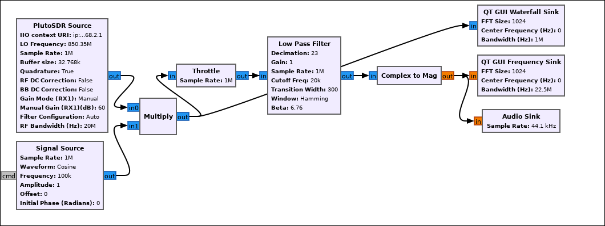

## Décodage des données numériques:

### 1. Schema Bloc GnuRadio

\newpage
### 2. Allure temporelle

{width=400px}

La 1ère allure temporelle correspond au signal avant le binary slicer, en suite le signal est converti en 0 ou 1 en fonction de son niveau de tension.

### 3. Durée d'un symbole

En analysant le signal reçu, on peut relever que la durée d'un symbole est de: **1ms**.

### 4. Séquence de bits tranmise

La séquence de bits répétées est la suivante:
**1010111010000000**

\newpage

## Réception de signaux audio

### 5. Spectre du signal audio reçu

{width=400px}

### 6. Ecoute du signal audio

Afin de pouvoir écouter l'audio il faut modifier la fréquence d'échantillonage car un fichier audio est échantilloné à 44.1kHz en général. Pour ce faire on ajoute de la décimation dans le filtre passe bas:
Par exemple, on avait une fréquence d'échantillonage de 1MHz pour passer à 44.1kHz il faut une décimation de 23. Pour écouter le signal on utilisé un bloc Audio Sink:

{width=400px}

\newpage

## Réception et recomposition d’un signal haché 

### 7. Waterfall Sink

J'ai placé la fréquence de mon Adalm Pluto à 850.45MHz sur le schema en cascade j'observe bien que le signal est émis 1s à -100kHz soit (850.35MHz) et puis 1 seconde à ma fréquence centrale (850.45MHz)

{width=400px}

### 8. Signal transmis à 850.35MHz

{width=400px}

Je peux bien écouter le signal transmis à 850.35MHz, j'entends un son de flute. Cependant, il y a une coupure d'une seconde régulièrement puisque le signal est transmis sur la fréquence 850.45MHz pendant ce temps la.

\newpage

### 9. Signal transmis à 850.45MHz

Je multiplie le signal en sortie (à 850.35MHz) par un signal sinusoïdale de 100KHz afin d'obtenir le signal à 850.45MHz.

### 10. Signal d'origine reçu

Il faut maintenant additioner le signal en sortie de l'Adalm Pluto avec le signal multiplié par la sinusoïde pour écouter en même temps sur les 2 fréquences et ainsi récupérer le signal d'origine.

J'obtiens bien le signal audio en entier.

\newpage

## Conclusion

Durant ce TP j'ai pu mettre en oeuvre les différents savoir acquis lors des TP précédent tel que le traitement des signaux contenant des données numériques ou bien des signaux audio. Grâce à ça j'ai pu récupérer le signal audio complet transmis avec des saut de fréquence à la fin.

