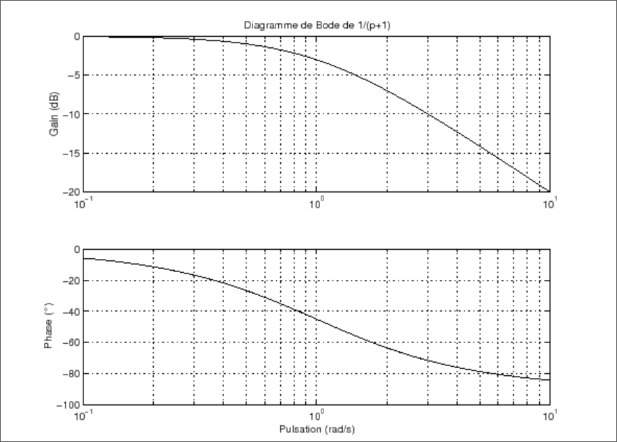
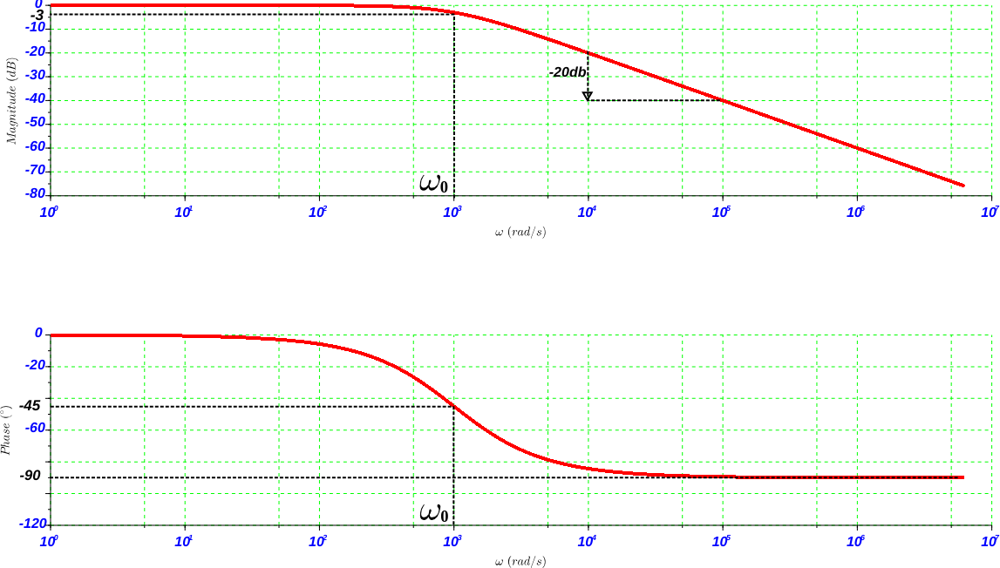
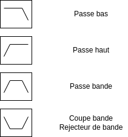

## Définition

Filtres:

- Système (ensemble de composants)
- Schema: (Une boite, 2 entrées, 2 sorties) -> Système multivariables
- Schema: (Une boite, 1 entrée, 1 sortie) -> Système monovariable
  
On utilise des systèmes linéaires
Un système linéaire obéit au principe de superposition

## Système Linéaire

Si:
$e_1(t)$ --> $s_1(t)$ et $e_2(t)$ --> $s_2(t)$

Alors:
$a.e_1(t) + b.e_2(t)$ --> $a.s_1(t) + b.s_2(t)$

Les systèmes modifient les signaux qui les traversent.

## Analayse harmonique d'un filtre

L'analyse harmonique d'un filtre consiste à appliquer des signaux sinusoïdaux à l'entrée du filtre et à étudier sa sortie.

On prend un filtre linéaire avec e(t) signal sinusoïdale en entrée.

$e_1(t) = 1.sin(\omega_1t)$
avec $\omega_1 = 2\pi f_1$

Entre le signal en sortie et le signal en entrée on remarque une différence d'amplitude $\Delta A$ et une différence de phase $\Delta \Phi$.

$s_1(t) = a_1(\omega_1(t) + \phi_1)$

\newpage

## Représentation d'un filtre par un diagramme de Bode

Le Gain en dB, c'est l'amplitude du signal de sortie, sur l'amplitude du signal en entrée.
On a : $G(dB) = 20.\log(G)$ avec $G=\frac{S}{E}$
$G= 10^{(\frac{G_{dB}}{20})}$, on peut en déduire l'amplitude du signal en sortie: $S=G\times E$

Dans le diagramme de phase, cette dernière peut être soit en degrés, soit en radian.

### Comment obtenir un diagramme de Bode

- Python, plusieurs librairie permettent de tracer un diagramme de Bode en fonction de la fonction de transfert du système
- Scilab
- Matlab (payant)

\newpage

On place notre fréquence sur les 2 diagrammes et on peut observer sur l'axe des ordonnées le gain et la phase correspondant. Cela explique que si j'applique un filtre à une fréquence $f_1$, j'obtiendrais un gain $G_1$ en dB grâce au diagramme.

Pour trouver la fréquence de coupure du filtre, on se place sur l'axe du gain et on descends de 3dB. A 3dB, la puissance du signal est divisé par 2 et l'amplitude A est divisé par $\sqrt{2}$. Sur la figure précédente, $\omega_0$ est la fréquence de coupure.

### Différents types de filtres

{width=150px}

\newpage

### Ordre du filtre

Pente: Pour chaque ordre on déscends de 20 dB/décade.

Exemple:

- Si on perd 20 dB/décade on a un filtre d'ordre 1
- Si on perd 40 dB/décade on a un filtre d'ordre 2
- Si on perd 100 dB/décade on a un filtre d'ordre 5

Dans GNU Radio, l'ordre est défini par la transition, plus la transition est faible plus l'ordre est grand mais la consommation de processeur est plus importante.
