## 1 - Etude du passage d’un signal sinusoïdal à travers un filtre

### 1. Réalisation du filtre

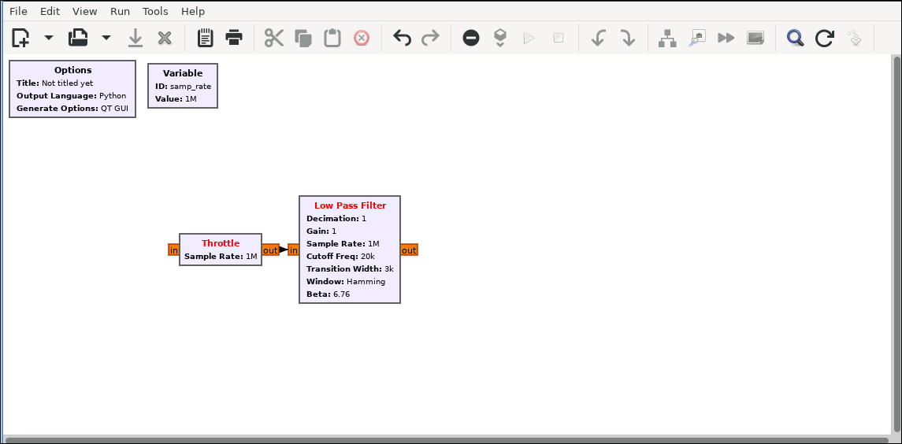

Le filtre à une fréquence de coupure de 20kHz et une plage de transition à 3kHz.

\newpage

### 2. J'ajoute un signal sinusoïdale de fréquence 1kHz

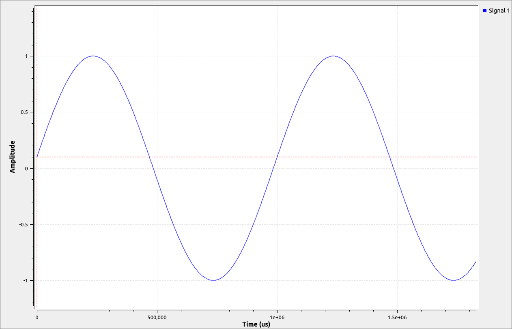{width=400px}

En sortie du filtre, on obtient un signal de forme sinusoïdale avec une amplitude de 1.

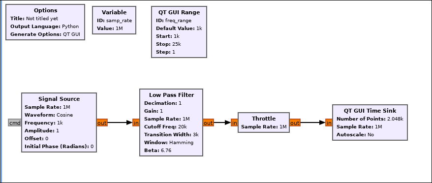{width=400px}

\newpage

### 3. Pour différentes fréquences du signal source:

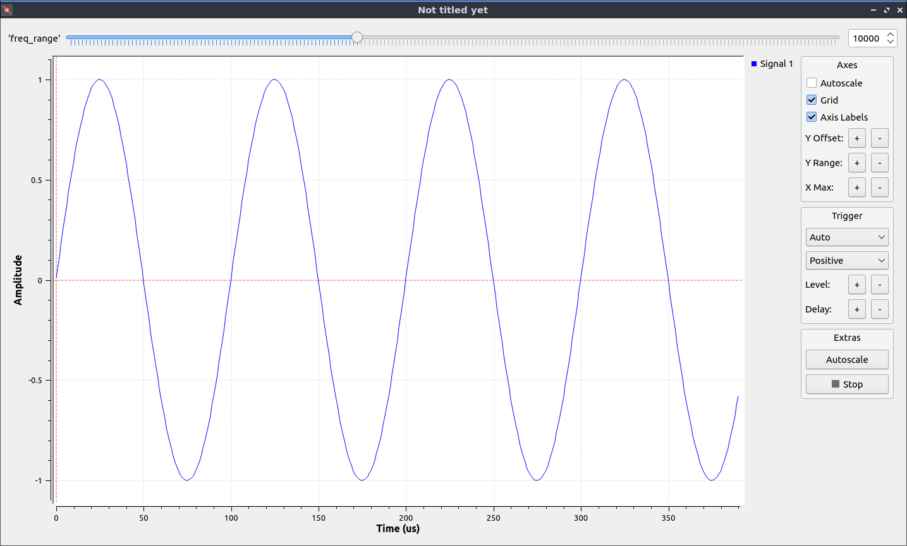{width=400px}

On a une amplitude de 1.

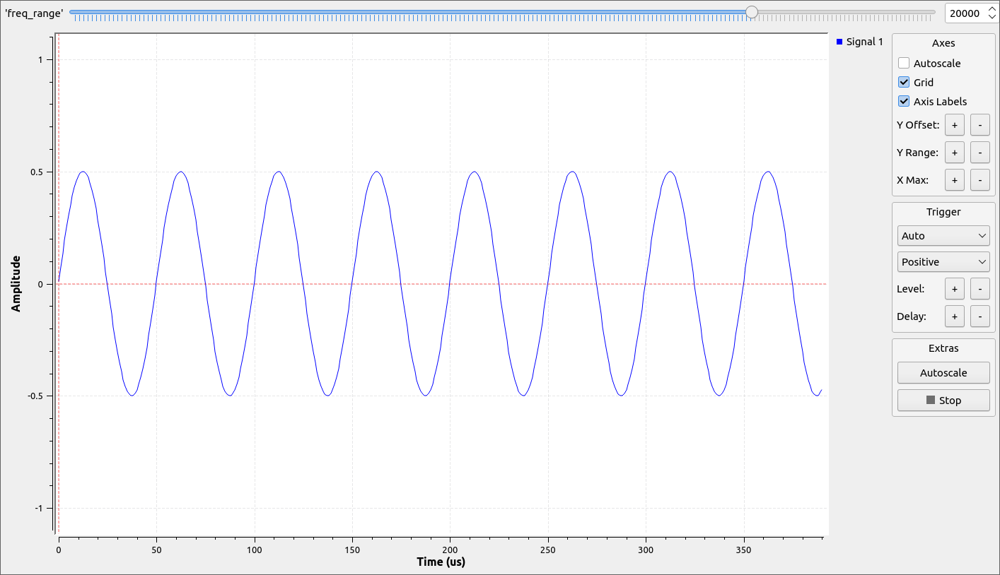{width=400px}

Le signal est à la fréquence de coupure du filtre, l'amplitude est desormais de 0.5.

\newpage

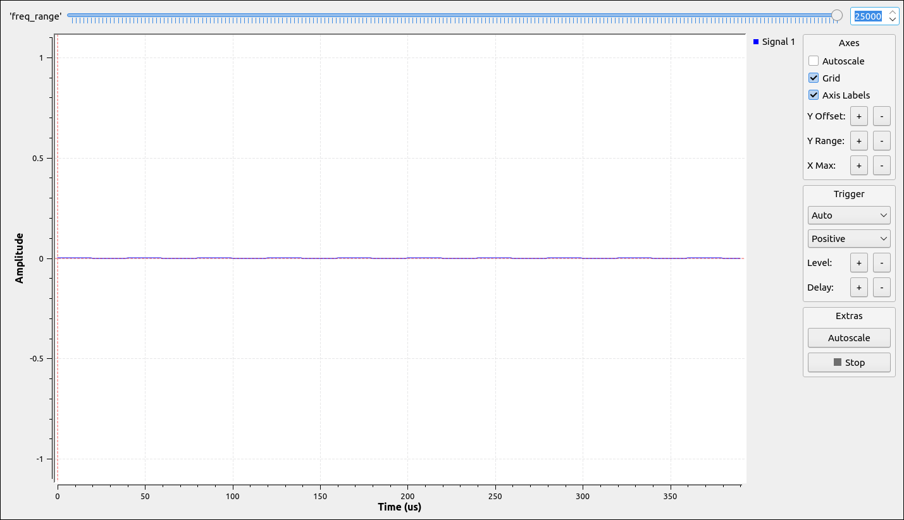{width=400px}

Aucun signel n'est observé en sortie. En effet, 25kHz > 20kHz, le filtre ne laisse pas passer le signal.

### 4. Amplitude du signal en sortie à 20kHz

En sortie du filtre à 20kHz, l'amplitude du signal est de 0.5 (voir Figure 5). En effet, ce résultat est en adéquation avec nos attentes car lorsque l'on se trouve à la fréquence de coupure on perd un gain de 3dB, la puissance est divisé par 2 et l'amplitude divisé par $\sqrt{2}$.

### 5. Bloc Range

J'ai ajouté un bloc range pour les fréquences du signal en entrée et pour la plage de transition du filtre:

\newpage

### 6. Etude de la plage de transition

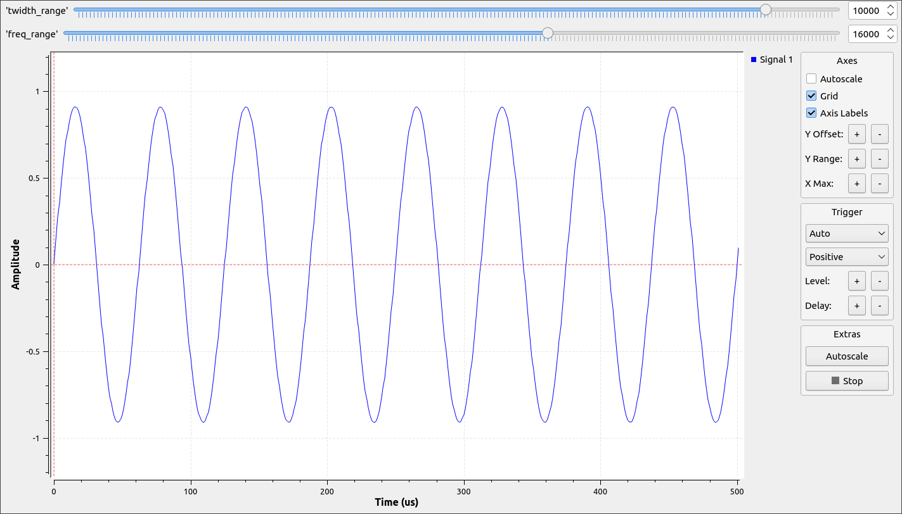{width=400px}

Pour un signal à 16kHz et une plage de transition à 10kHz, je remarque que l'amplitude du signal diminue déja. Alors que, lorsqu'elle était configuré à 3kHz, il fallait être proche des 20kHz (19kHz par exemple) pour voir l'amplitude du signal diminué.

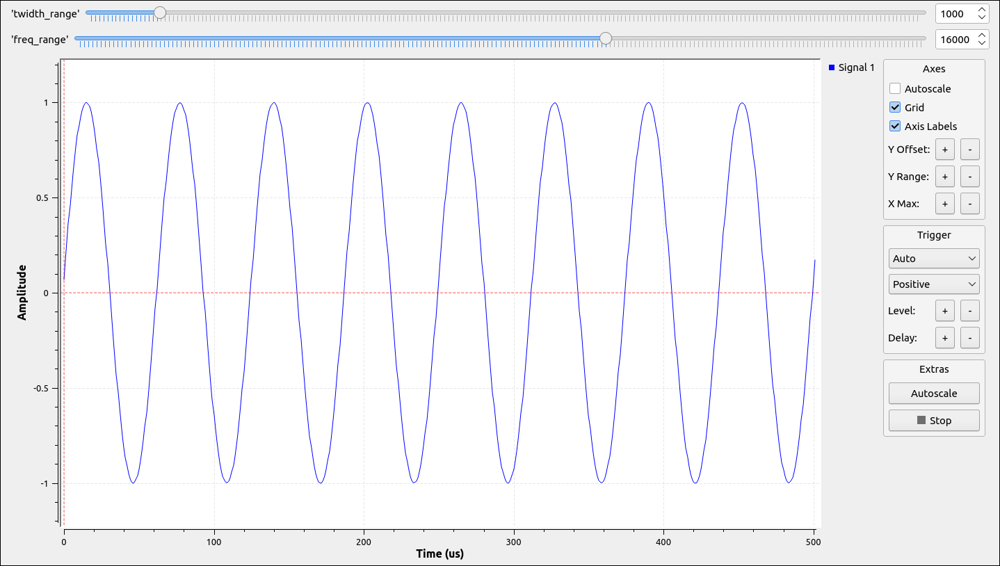{width=400px}

On remarque que si la plage de transition vaut 1kHz pour ce même signal, l'amplitude reste à 1 et n'a pas encore commencé à diminué.

\newpage

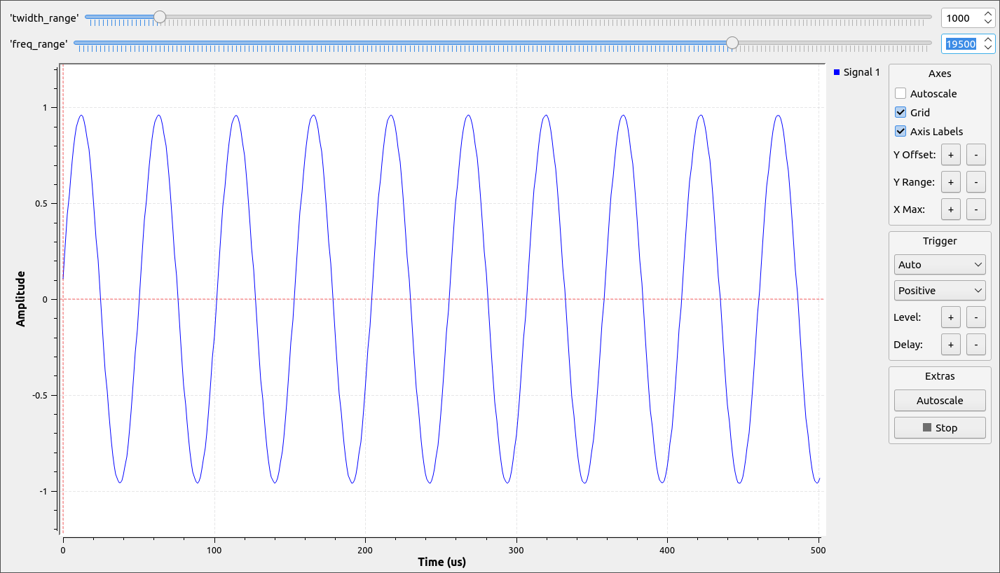

En revanche, pour un signal à 19.5kHz, on remarque que l'amplitude commence à diminuer (elle n'est plus égale à 1). J'en déduis que plus la plage de transition est grande plus le filtre va couper rapidement. Mais, si la plage de transition est faible, le filtre coupera très proche de sa fréquence de coupure on aura une coupure nette.

### 7. Etude d'un filtre passe bande

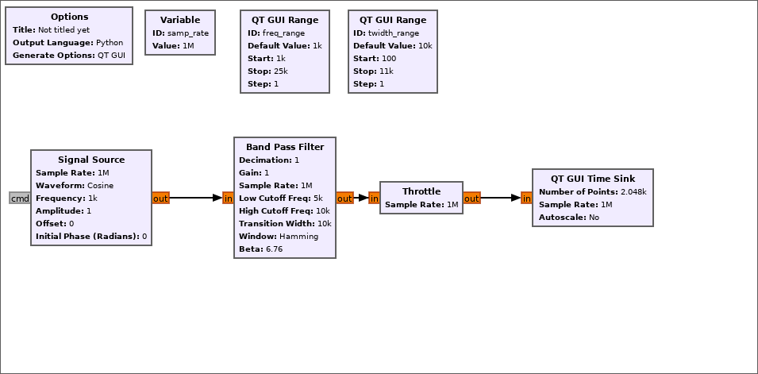{width=400px}

\newpage
J'étudie le comportement de mon signal à travers un filtre passe bande laissant passer les signaux entre 5kHz et 10kHz.

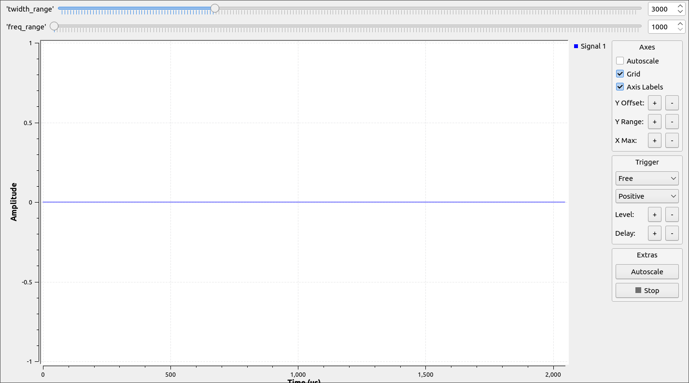{width=400px}

On remarque qu'aucun signal ne passe, c'est normal 1kHz < 5kHz (fréquence de coupure basse du filtre).

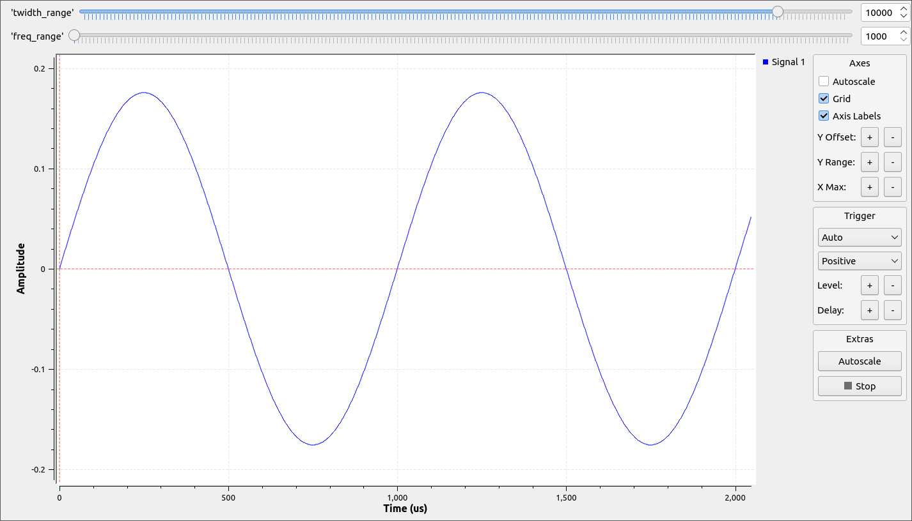{width=400px}

En revanche, si je change la fréquence de coupure à 10kHZ, je remarque que j'obtiens un signal en sortie de mon filtre. Ce signal à une amplitude de 0.18.

\newpage

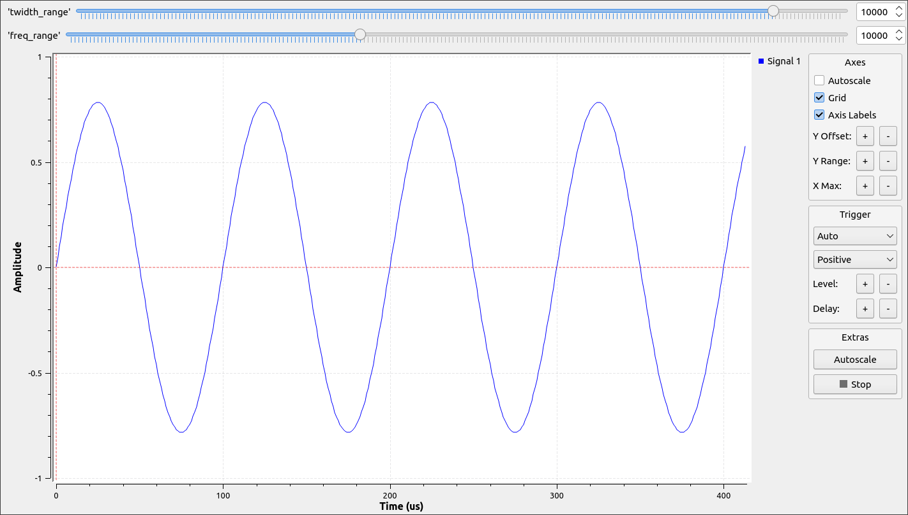{width=400px}

On obtient un signal avec 0.7 d'amplitude, le signal étant à la fréquence de coupure, l'amplitude diminue assez lentement à cause de la plage de transition élevé.

{width=400px}

On obtient un signal avec 0.5 d'amplitude. Ici la diminution de l'amplitude est bien plus rapide, la coupure du filtre étant plus nette lorsque la plage de transition est faible.

\newpage

### 8. Combinaison de filtre

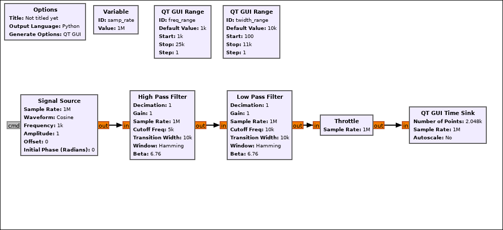{width=400px}

J'ai réalisé le même filtre passe-bande utilisé précédemment mais cette fois-ci en additionnant 2 filtres en série (Laisse passer entre 5kHz et 10kHz). Pour réaliser ce filtre, j'ai d'abord un filtre passe haut avec une fréquence de coupure de 5kHz pour laisser passer tout les signaux supérieurs à 5kHZ puis un filtre passe bas avec une fréquence de coupure de 10kHz qui empêche les signaux supérieur à 10kHz de passer.

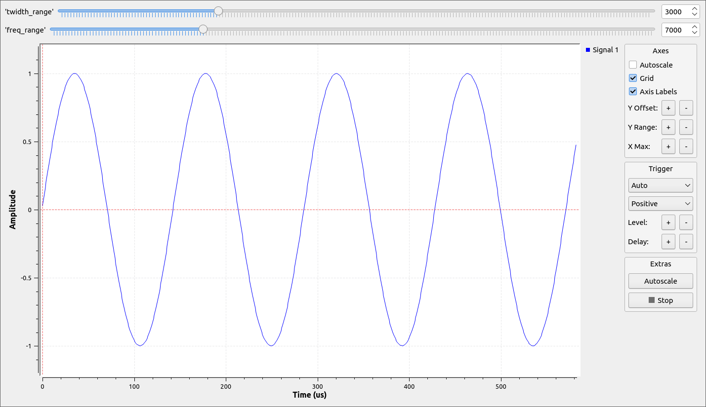{width=400px}

On reçoit un signal à 1 d'amplitude, c'est normal puisque 5kHZ < 7kHz < 10kHz, la fréquence du signal est bien au milieu des 2 fréquences de coupure donc le signal passe entièrement.

\newpage

## 2- Caractérisation d’un filtre à l’aide d’une source de bruit blanc

### 9. Génération du bruit

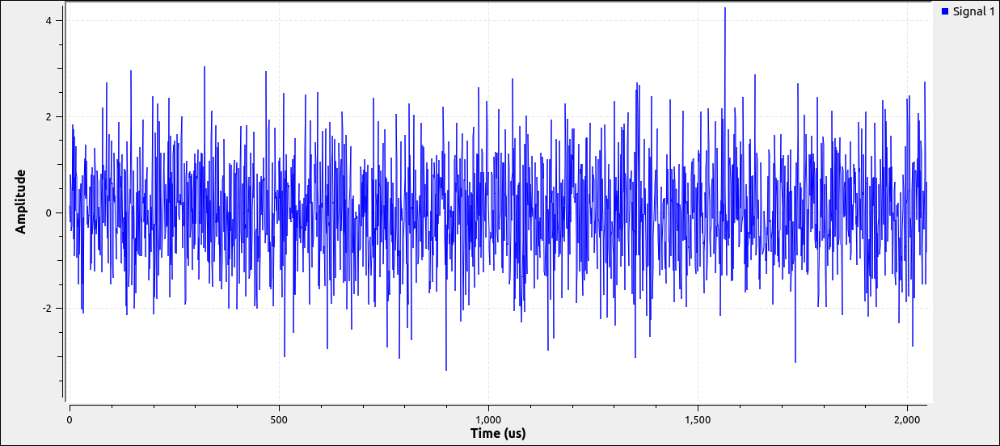{width=400px}

On remarque que l'evolution de l'amplitude au cours du temps pour le bruit blanc est totalement aléatoire avec certains pics bien plus haut ou plus bas que les autres.

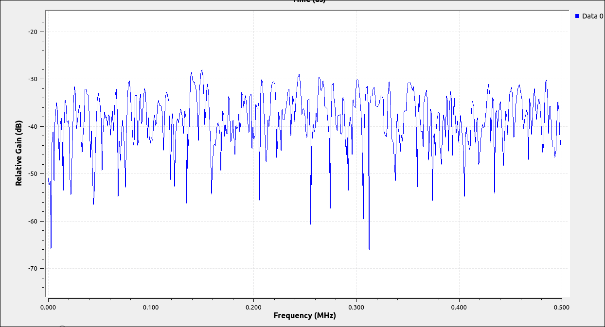{width=400px}

De même pour l'evolution fréquentielle du signal, avec du bruit blanc on a des fréquences aléatoires sur le spectre.

\newpage

### 10. Etude du filtre passe bas

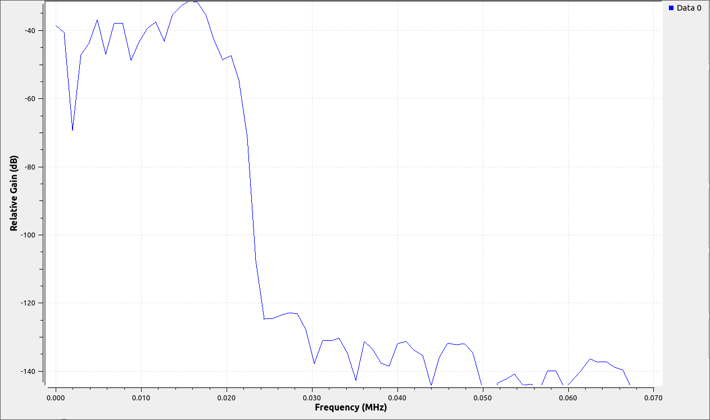

On remarque que les fréquence entre 0 et 20kHz peuvent très bien passé. Néanmoins, on remarque une coupure nette avec une chute rapide du spectre au alentour de 20kHZ cela se caractérise par la plage de transition faible (100hZ) appliqué à ce filtre.

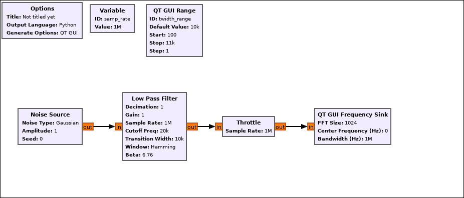

\newpage

### 11. Changement de plage de transition

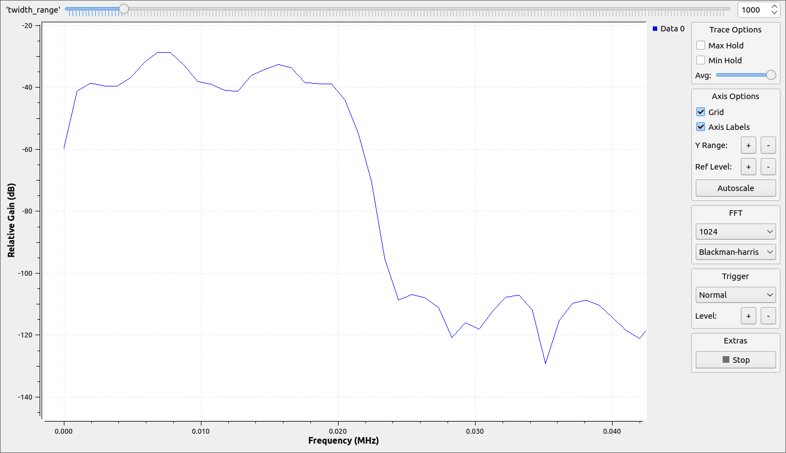{width=400px}

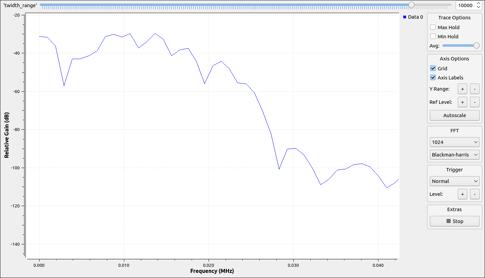{width=400px}

On remarque que pour la plage de transition à 1kHz on a le spectres qui diminue d'un coup autour de la fréquence de coupure. Alors que lorsque la plage de transition est à 10kHz, le spectres diminue bien plus lentement et autour de 24kHz.

\newpage

### 12. Etude sur un filtre passe bande

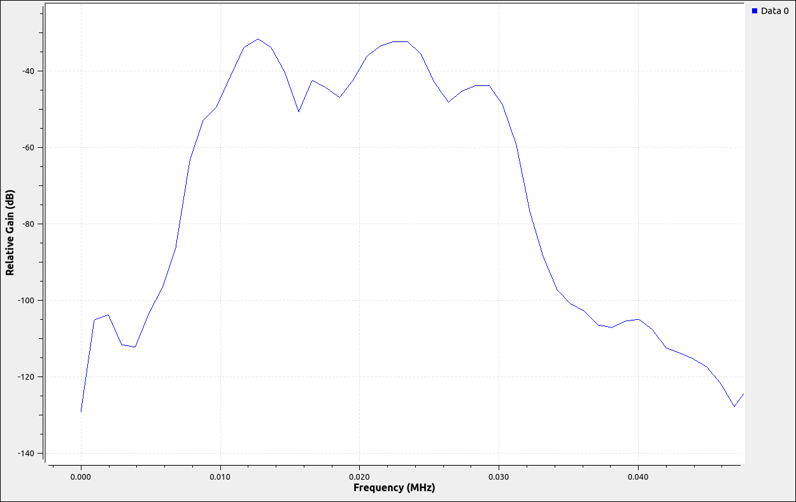{width=400px}

J'ai mis un filtre passe bande laissant passer uniquement entre 10kHz et 30kHz, ici j'ai une plage de transition de 3kHz, on voit bien autour de 10kHz et 30kHz une diminution du spectres rapide montrant bien que les fréquence comprises dans cette intervalle passe.

### 13. L'inconvénient des transition abruptes

En pratique, le principale inconvénient des transition abruptes d'un filtre c'est la demande en puissance de calcul dans le cas de transmission SDR par exemple. Ou pour des transmissions analogique, il faudra bien plus de composants pour réaliser un filtre avec une telle transition.

\newpage

## 3- Réalisation d'un equalizer

### 14. Réalisation du diagramme de flux de l'equalizer

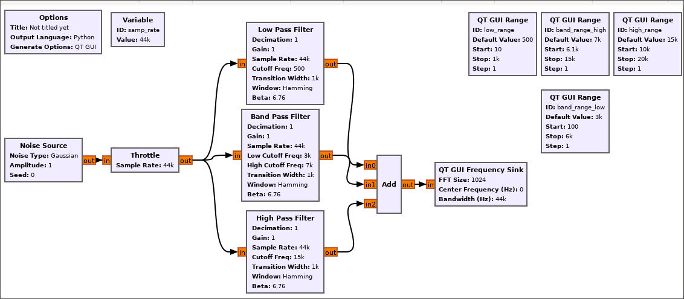

Les différents filtres sont placés en parallèle grâce au bloc addition. On peut les régler avec différents curseurs.

### 15. Analyse de l'équalizer

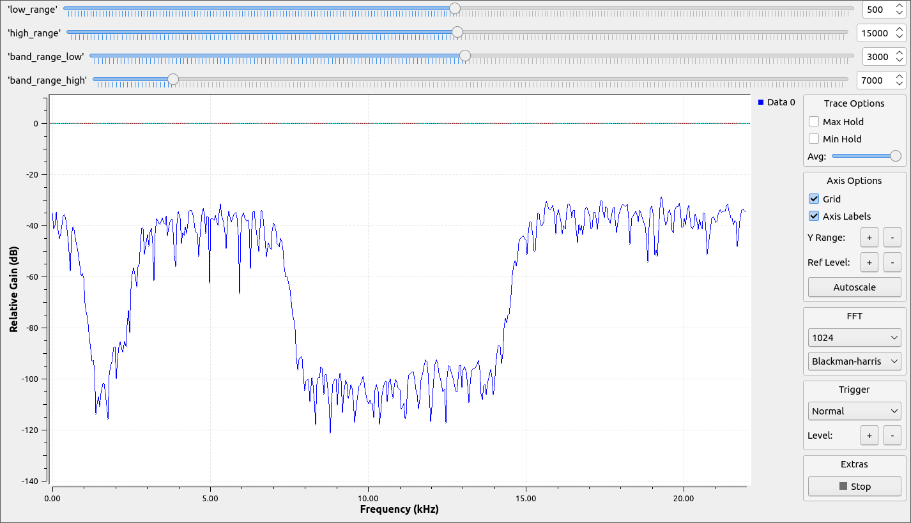{width=400px}

Pour obtenir ce spectre on a pour le filtre passe bas $f_c=500$Hz, pour le passe bande $f_{c1}=3$kHz et $f_{c1}=7$kHz et pour le filtre passe haut on a $f_c=15$kHz.

\newpage

### 16. Observation de l'equalizer sur un fichier audio

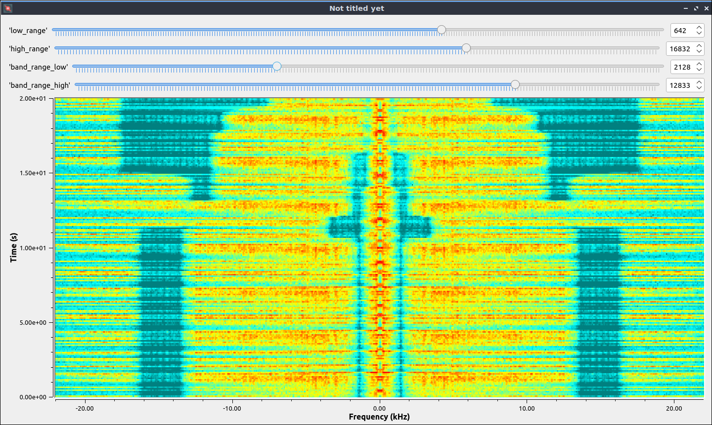{width=400px}

On peut observer des changement au cours du temps au niveau des fréquences qui passe en changeant les différents paramètres de l'équalizer au cours du temps.

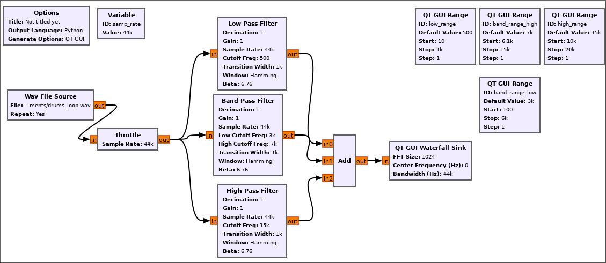

### 18. Conclusion

Après avoir écouté le fichier audio en rajoutant un bloc Wav File Sink et en modifiant les différentes valeurs des filtres. On remarque que l'on peut modifier certains paramètres du fichier audio tel que la basse, les medium et les aigus. Cela permet par exemple de masquer un instrument ou un son.
