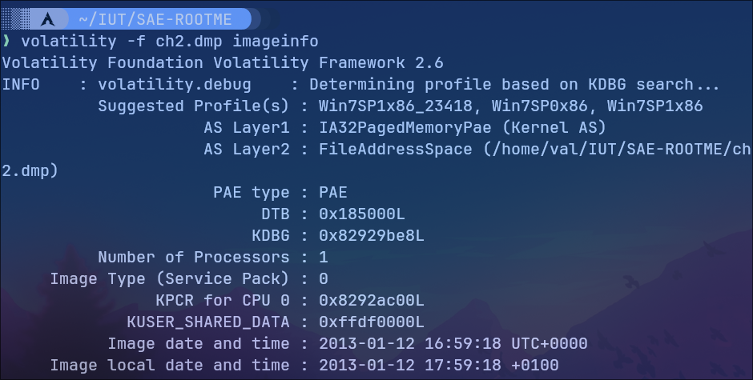
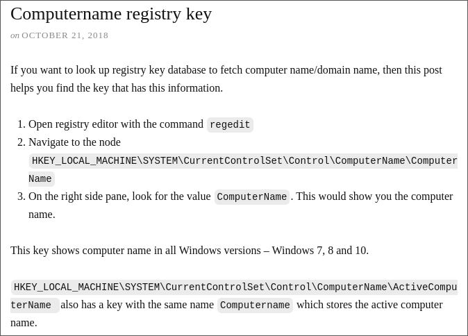
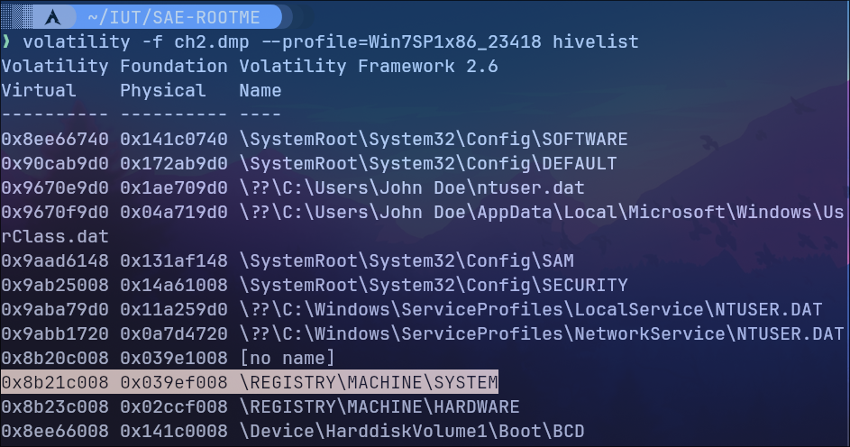
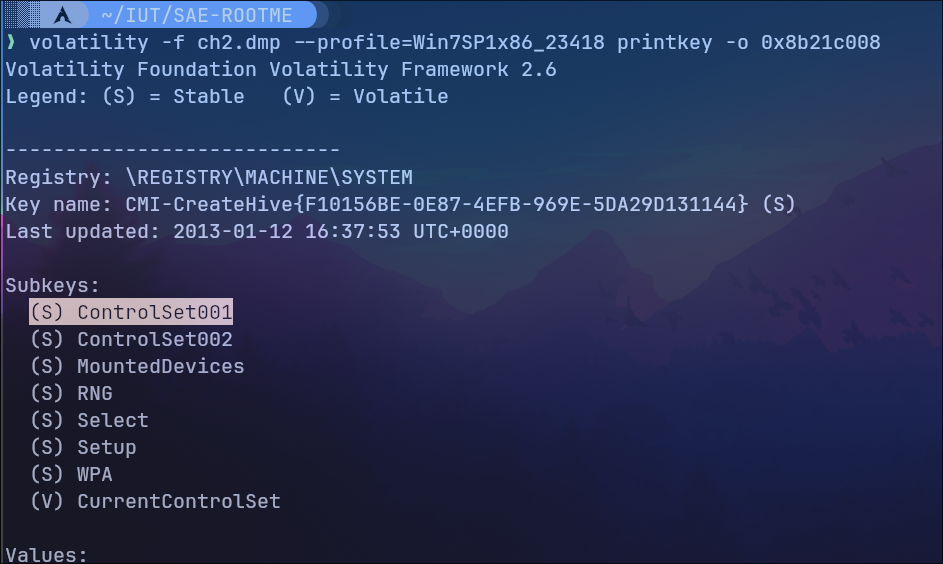
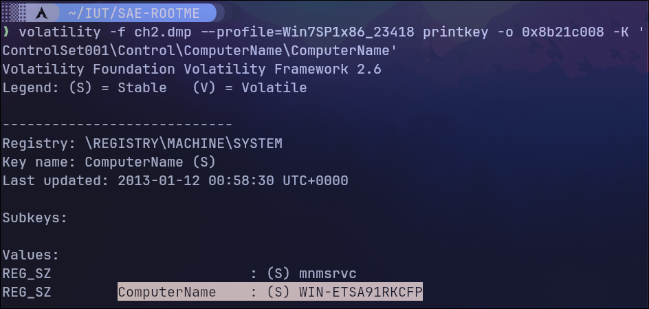

# ROOT-ME - Command & Control niveau 2

Je dispose d'un dump mémoire a analysé, je vais utiliser Volatility afin de trouver le mot de passe, ici l'hostname de la machine.

Dans un premier temps, je regarde les infos sur le dump afin de savoir quel profile utilisé sur Volatility par la suite.



Le dump mémoire a été fait sur une machine Windows 7, j'utiliserai donc le profile **Win7SP1x86_23418** pour mes prochaines analyse.

Avec volatility, on peut afficher la hivelist, c'est un endroit principal du registre windows ou l'on retrouve des clés et des sous-clés du registre.



En cherchant sur Internet, je peux trouver l'hostname de la machine dans la clé de registre suivante:

```HKEY_LOCAL_MACHINE\SYSTEM\CurrentControlSet\ComputerName\ComputerName```

Je vais donc chercher à retrouver la valeur de cette clé avec Volatility.

## 1. Afficher la hivelist



On souhaite récupérer la clé SYSTEM à l'adresse 0x8b21c008

## 2. Récupérer la clé



Maintenant il faut récupérer la sous-clé qui contient la valeur de ComputerName. Cette sous clé se trouve dans ce chemin: ```ControlSet001\Control\ComputerName\ComputerName``` que l'on peut donner en argument de l'options -K.

## 3. Récupérer la valeur de l'hostname



On récupérer bien la valeur du ComputerName, qui est aussi le mot de passe du challenge donc ```WIN-ETSA91RKCFP```
