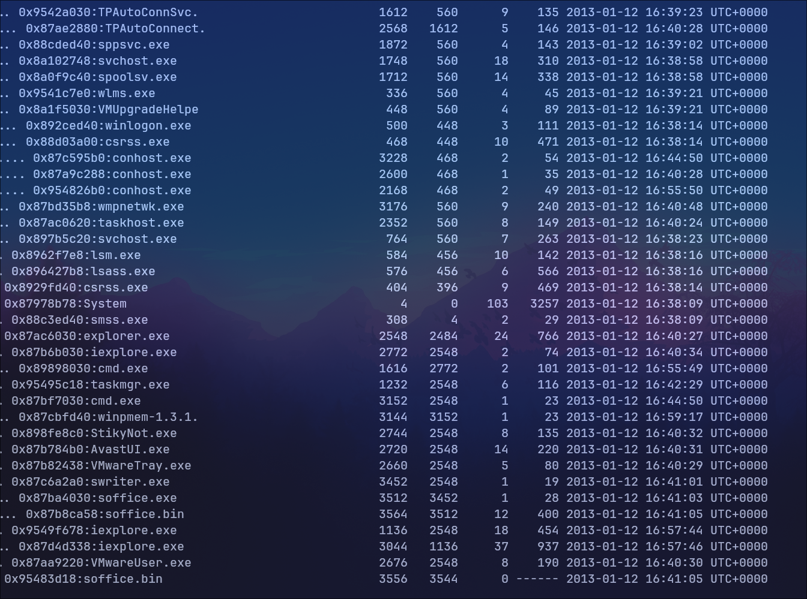
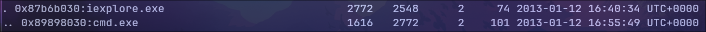
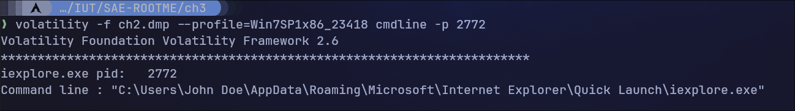
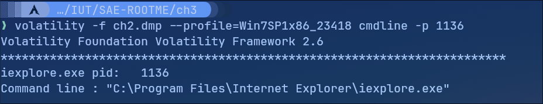
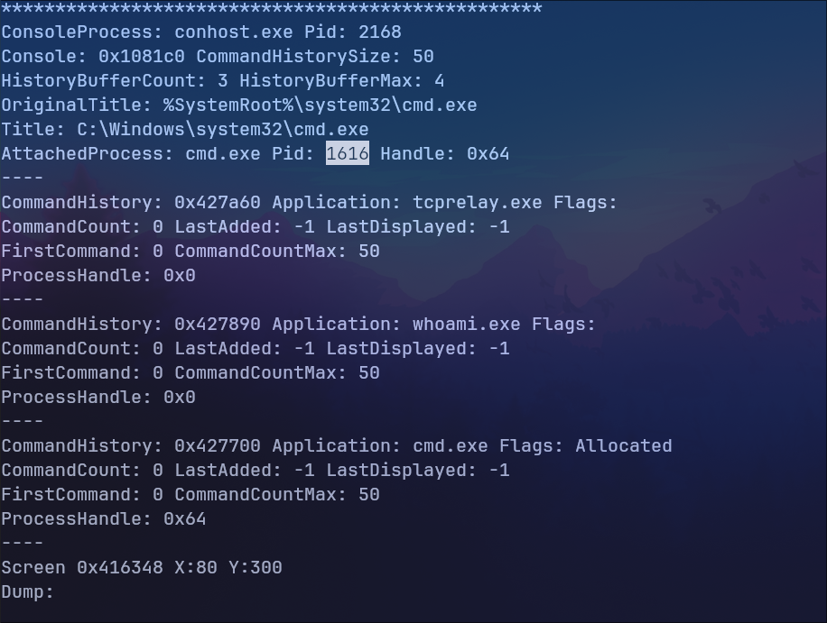
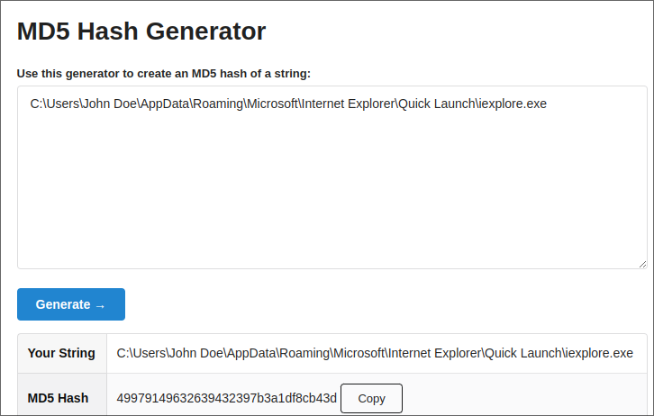

# ROOT-ME - Command & Control niveau 3

On cherche dans le dump mémoire un programme malveillant, le mot de passe est le hash du chemien absolu vers l'executable.

## Lister les processus

J'utilise Volatility et la commande suivante:

```bash
❯ volatility -f ch2.dmp --profile=Win7SP1x86_23418 pstree
```



On remarque sur la figure précédente qu'il y a 2 processus iexplore.exe d'ouvert c'est l'executable d'Internet Explorer en général, mais on remarque également que l'un d'entre eux execute un processus cmd.exe relatif à l'execution d'un terminal sous Windows.



Je vais regarder sur le pid 2772 le chemin absolu le fichier lancé grâce à la commande cmdline.



Je compare avec le chemin de l'autre processus iexplore.exe (PID 1136)



Ce fichier semble être le vrai internet explorer installé dans le répertoire usuel des programmes windows.

On peut également regarder l'historique des commandes utilisés avec le modules consoles de Volatilty:



On remarque que le processus cmd.exe au PID 1616 qui est executé par le processus 2772 ouvre un programme tcprelay.exe qui est surement suspicieux au point de peut-être ouvrir une backdoor ?

Le programme malveillant est donc celui au PID 2772 se trouvant ici:
```C:\Users\John Doe\AppData\Roaming\Microsoft\Internet Explorer\Quick Launch\iexplore.exe```



On récupérer le hash du chemin Absolu du fichier. Le mot de passe du challenge est donc ```49979149632639432397b3a1df8cb43d```.
