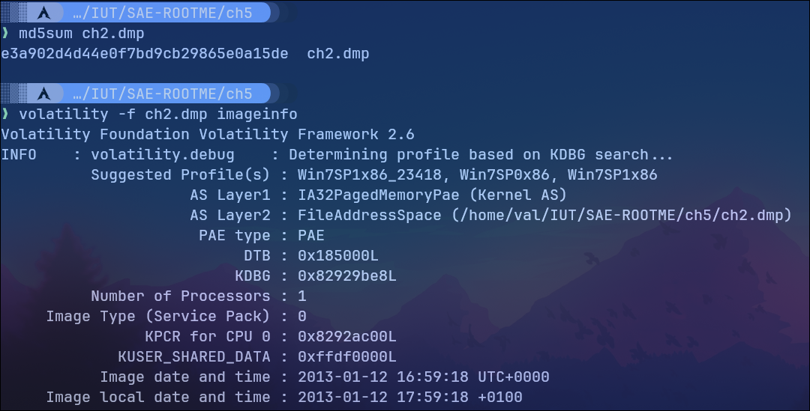
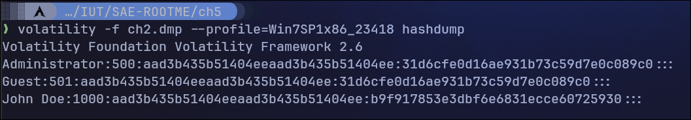
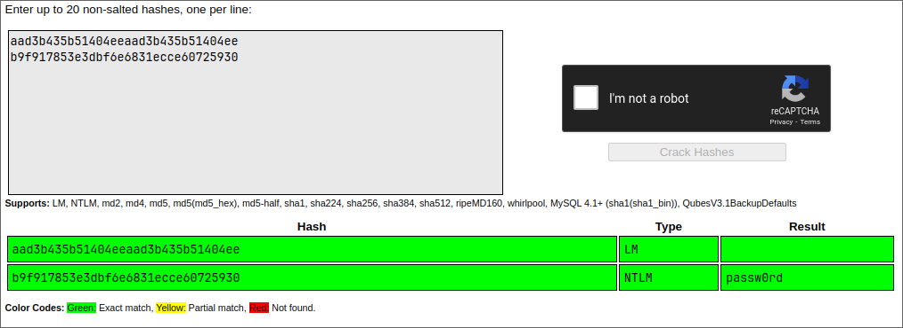

# ROOT-ME - Command & Control niveau 5

J'utilise Volatilty pour récupérer le mot de passe du challenge, ici le mot de passe de l'utilisateur.

## Récupération de l'information sur l'image du dump mémoire



J'utiliserai le profile **Win7SP1x86_23418** pour la suite.

Avec Volatilty on peut récupérer une liste des hashs contenant les informations de connexions des utilisateurs (l'équivalent du fichier /etc/shadow sous Linux) avec la commande suivante:

```bash
❯ volatility -f ch2.dmp --profile=Win7SP1x86_23418 hashdump
```

## Récupération des hashs



Chaque ligne de cette list est constitué de cette façon:

1er champ: Nom d'utilisateur
2ème champ: RID (Relative Identification)
3ème champ: Hash LM (Lan Manager)
4ème champ: Hash NTLM

On peut cracker ces hashs avec une attaque par dictionnaire utilisant une liste de hashs connues pour les mots de passe les plus fréquents. Le site crackstation permet de faire cela facilement.



Le mot de passe est donc ```passw0rd```.
