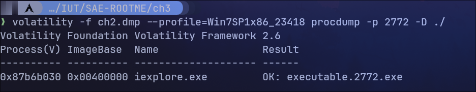
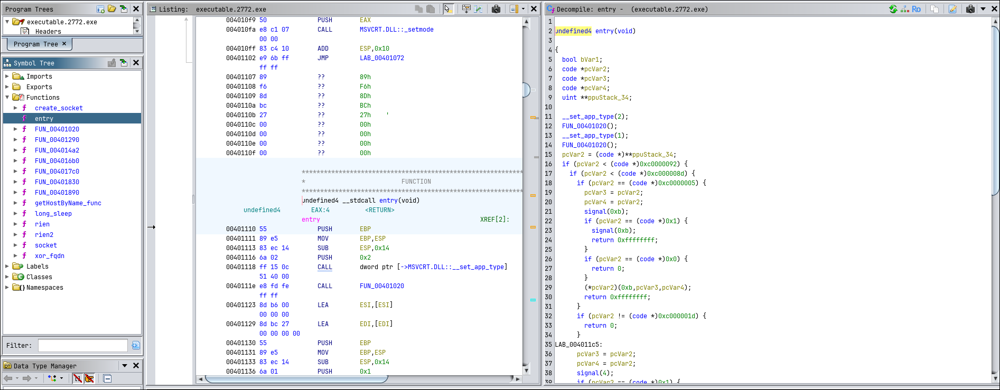
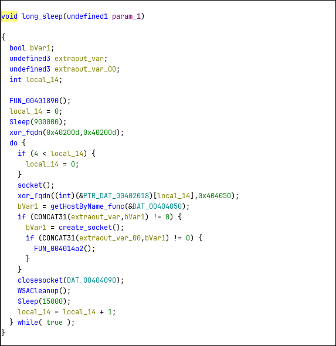
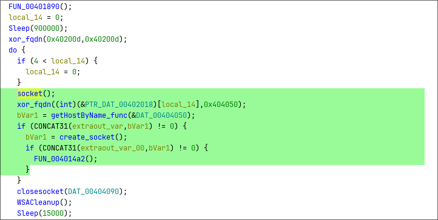
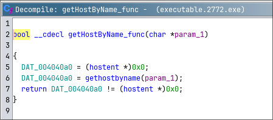
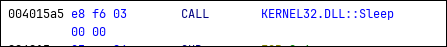
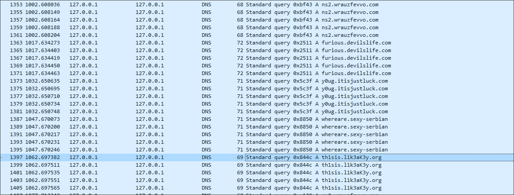

# ROOT-ME - Command & Control niveau 6

Après avoir trouvé lors du niveau 3 quel programme était infecté, il faut maintenant l'extraire pour l'analyser.

## Extraction du programme

Une fois le programme récupéré, je l'ouvre dans Ghidra afin de l'analyser.

## Ghidra

En chargant le programme sur Ghidra on tombe directement sur la fonction entry:

On voit à gauche qu'il y a quelques fonctions dans ce programme, j'en ai renommé certaine pour ne pas me perdre dans mes recherches, on peut observer au centre le code Assembleur et à droit le code en C.

On remarque une fonction dans laquelle il y a un temps d'arrêt assez long (900000ms soit 15minutes)

Lance une fonction qui vient Xorer les arguments passez dans cette fonction.

Ensuite, le programme viens créer une socket pour se connecter à distance sur le serveur de l'attaquant, le fqdn est à nouveau Xorer, la valeur xorer est ensuite mise dans une fonction qui va effectuer une requête DNS.

J'ai essayé de changer l'instruction qui appel la fonction sleep CALL en NOP afin de visualiser dans une VM Windows la requête DNS et ainsi pouvoir récupérer le FQDN qui est le mot de passe du challenge. Cependant, une fois l'instruction modifié le programme ne voulait pas se lancer

## Lancement du programme dans une VM Windows

J'ai créer une VM Windows 10 isolé du réseau avec comme serveur DNS 127.0.0.1 afin de visualiser les requêtes DNS sur la carte loopback et voir le FQDN, j'ai donc du attendre 15min que le sleep se termine puisque je n'ai pas réussi à le modifier.

Au bout de 15 minutes, j'observe des requêtes DNS arrivait sur 4 FQDN:

- ns2\.wrauzfevvo.com
- furious\.devilslife.com
- y0ug\.itisjustluck.com
- whereare.sexy-serbian

Et quelques secondes plus tard, une autre requête apparait sur un autre FQDN qui semble être le mot de passe du challenge: **th1sis\.l1k3aK3y.org**

C'est bien le mot de passe du challenge.
