# SAE6C01 - Root-me Find me

J'analyse le dump mémoire avec Volatility pour obtenir plus d'informations sur le profil à utilisé:

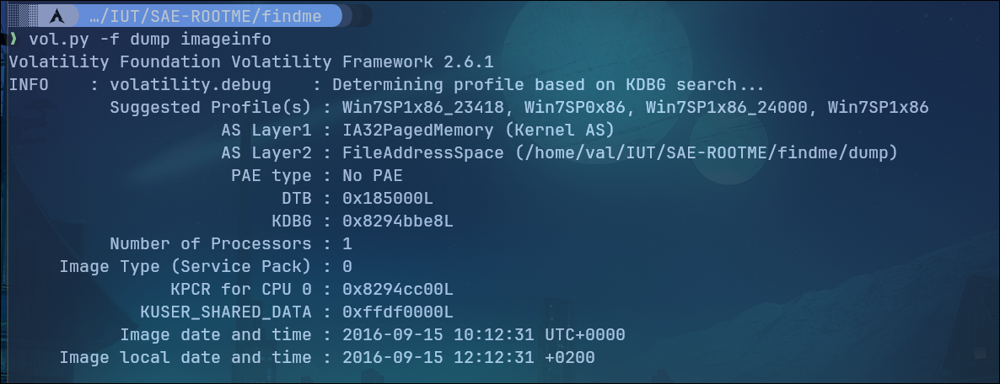

C'est une capture de RAM qui a été faites sur une machine windows7, le profile que j'utiliserais et le suivant: Win7SP1x86_23418.

Je commence à regarder au niveau des processus:

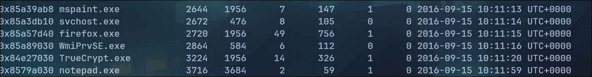

Je remarque 4 processus interessant:

- mspaint.exe
- notepad.exe
- firefox.exe
- truecrypt.exe

J'ai regardé dans un premier temps du côté de truecrypt pour trouver un fichier à monter avec cet outil.

J'ai donc regardé sur le Bureau pour commenncer et j'ai trouvé un fichier "findme".

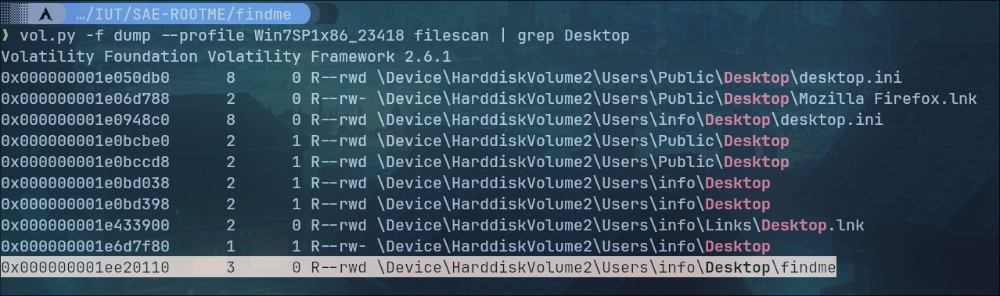

Je recupère le fichier:

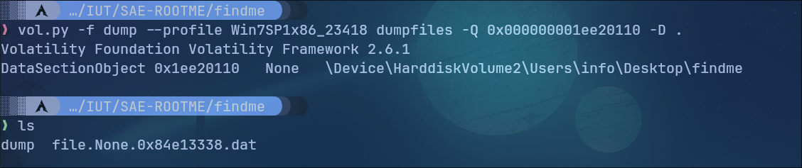

Il s'agit bien d'un fichier TrueCrypt mais il me faut le mot de passe pour déchiffrer cette partition.

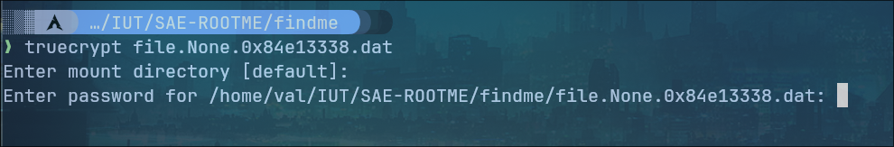

 Je peux le récupérer avec le plugins **truecryptsummary** de Volatility.

 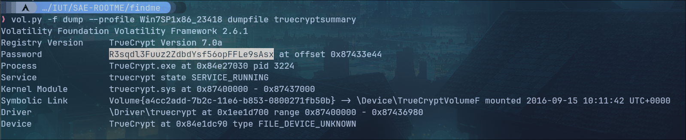

 Je peux donc monter la partition Truecrypt trouvée.

 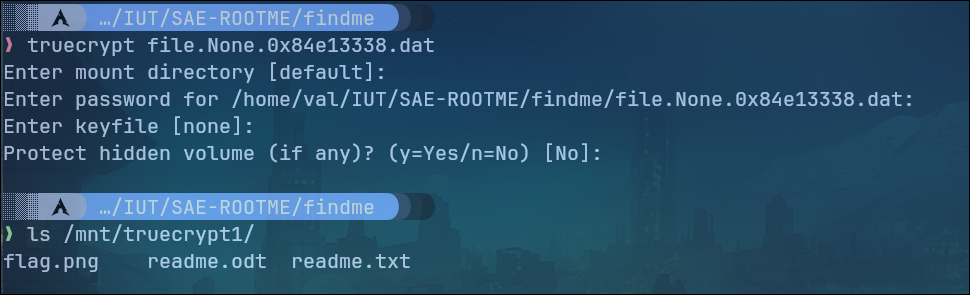

Le volume contient un fichier flag.png et readme.txt qui nous indique que le flag n'est pas là (c'est surement les fichiers ouvert dans notepad.exe et mspaint.exe).

Il y a ensuite un fichier ODT qui continet une FAQ sur Keepass en apparence mais qui parait suspect lorsque l'on utilise file dessus.

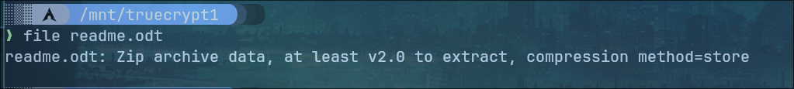

En effet, il s'agit d'un fichier ZIP dont nous pouvons extraire le contenu.

Une fois le contenu de l'archive extrait on se retrouver avec plusieurs fichier dont un très interessant:

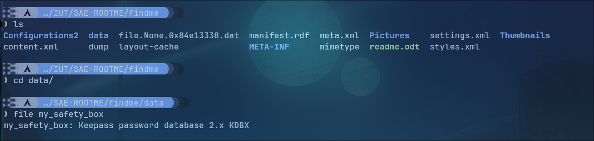

Il s'agit d'un fichier Keepass (gestionnaire de mot de passe) néanmoins, il faut trouver la masterkey.

Je regarde dans le dump mémoire si je peux obtenir des informations avec le presse-papier ou les utilisateurs locaux.

Le presse-papier contient le mot de passe du volume Truecrypt.

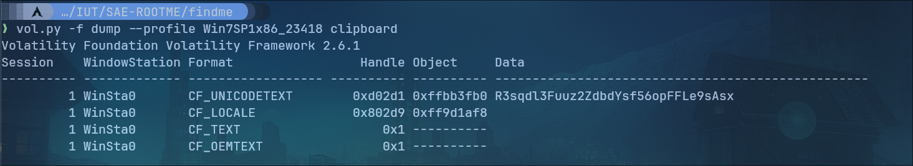

J'essaie donc avec les utilisateurs locaux.

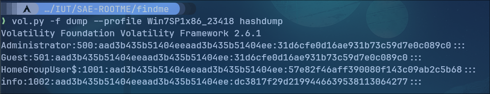

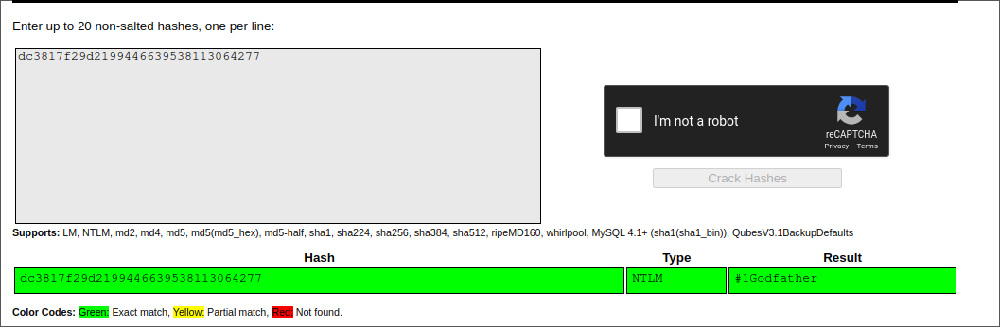

Il y a un utilisateur info dont j'ai pu récupérer le hash. Je place le mot de passe trouvé (#1Godfather) ainsi que le mot de passe du volume Truecrypt en haut de la wordlists **rockyou.txt** afin de faire une attaque par dictionnaire sur le fichier keepass.

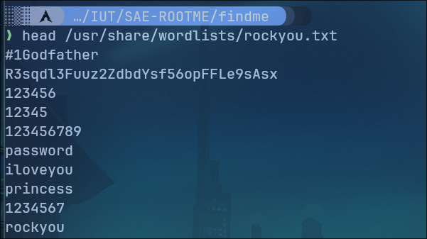

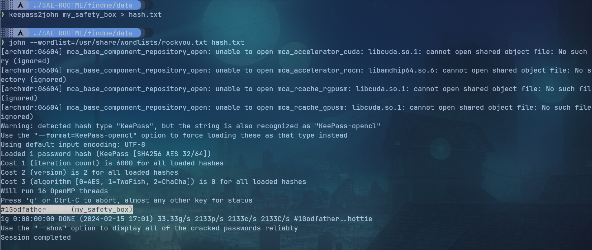

Le mot de passe de l'utilisateur info (#1Godfather) est bien le mot de passe de l'archive Keepass, je vais pouvoir l'ouvrir.

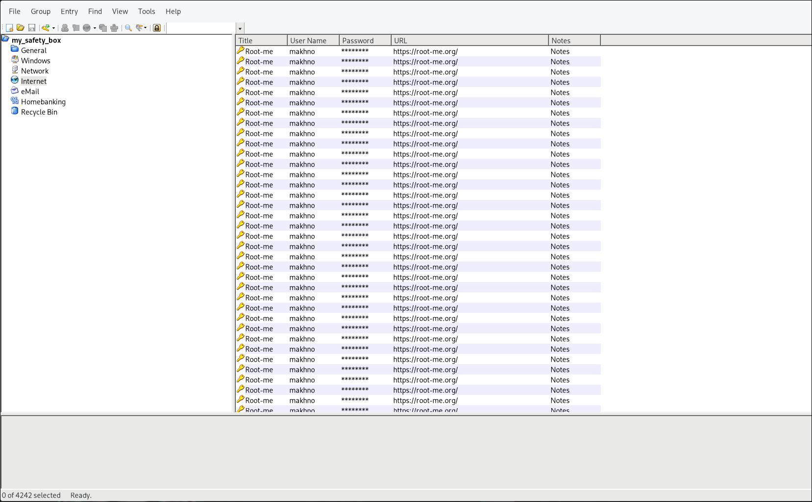

On retrouver 4242 mot de passes, je décide d'exporter la base de données en CSV pour observer les mots de passe de plus près.

On retrouver bien les 4242 mots de passe qui semblent être tous hashé, sauf un qui est bien plus long que les autres et lui encodé en base64.

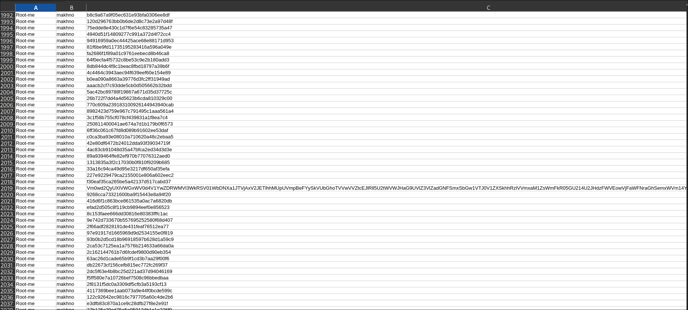

Je décide de le décodé, et je m'appercois qu'il contient un autre base64, je fais donc un script qui va decodé en base64 jusqu'a ce que le binaire base64 renvoie une erreur d'input incorrect.

Le script est le suivant:

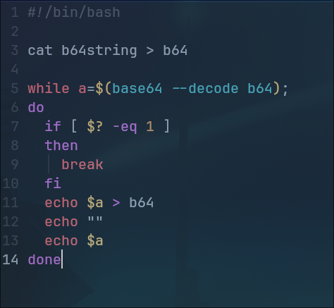

J'execute le programme pour récupérer le flag:

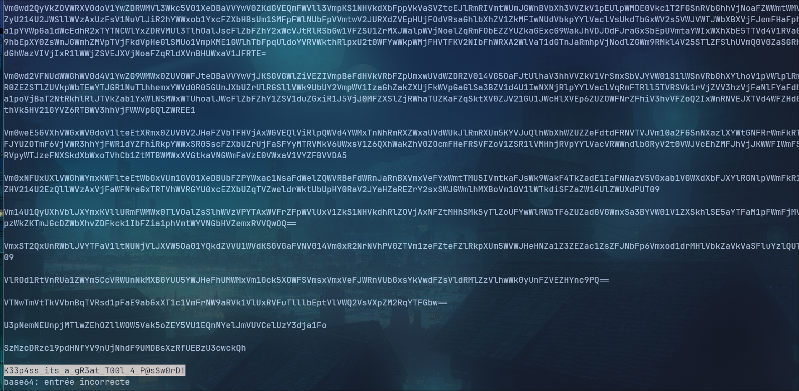

J'obtiens bien le flag qui est ```K33p4ss_its_a_gR3at_T00l_4_P@sSw0rD!```.