# SAE6C01 - Root-me Find me again

Je commence par analyser les fichiers du challenge:

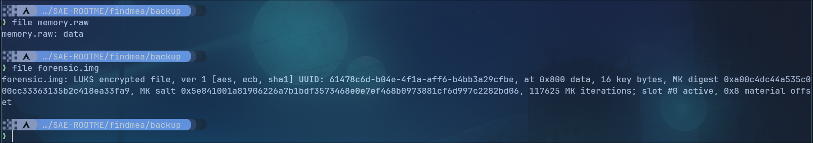

Il y a un dump de la mémoire et une image disque LUKS donc crypté.

Je commence par analyser le dump de RAM et je remarque qu'il n'y a aucun profil adapté. La machine est sous Linux comme l'indique la partition Luks et volatility ne possède pas de profil Linux par défaut il faut ajouter un profil personnalisé.

Pour ajouter le profil, il faut d'abord regarder dans les strings quel OS tourne sous la machine avec quel version et également quel kernel et sa version.

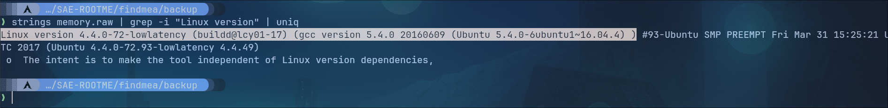

Il s'agit d'une machine sous Ubuntu 16.04.4 avec un kernel linux 4.4.0-72-lowlatency. En cherchant sur google j'ai trouvé un profil déja fais pour cette version, ce qui m'évite de faire une VM sous Ubuntu avec le bon kernel pour créer moi même le profil. (<https://github.com/sigalpes/volatility-profils/blob/master/linux/Ubuntu16044.zip>)

Je place le fichier .zip dans le répértoire ou volatility à été cloné puis dans volatility/plugins/overlays/linux.

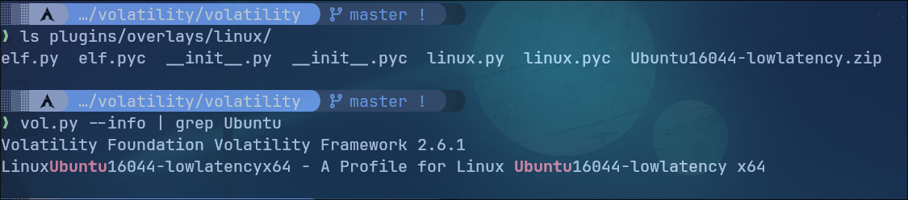

Le profil est bien chargé je peux passer à l'analyse de RAM.

Je commence par analyser l'historique des commandes:

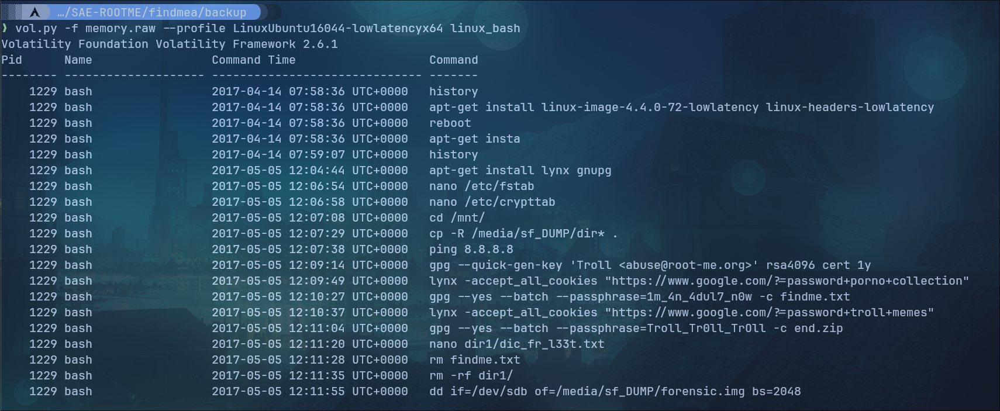

On remarque plusieurs informations importantes:

- 2 mots passes pour déchiffrés des fichiers avec gpg:

  - 1m_4n_4dul7_n0w pour findme.txt
  - Troll_Tr0ll_TrOll pour end.zip
- Un dictionnaire est créer puis supprimé
- Les fichiers findme.txt, end.zip et le dictionnaire supprimé se trouve dans l'image Luks.

Je cherche donc un moyen de monter l'image Luks. Et avec l'outil findaes je trouve la masterkey pour déchiffrer l'image luks et ainsi la monter:

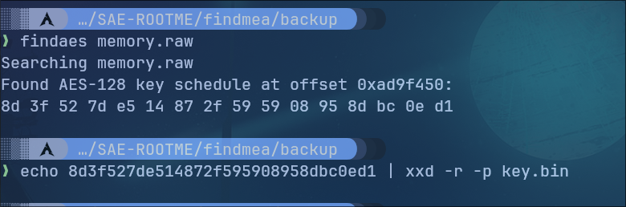

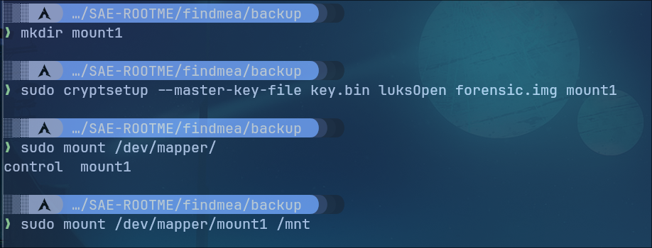

Le volume Luks est bien monté et déchiffré.

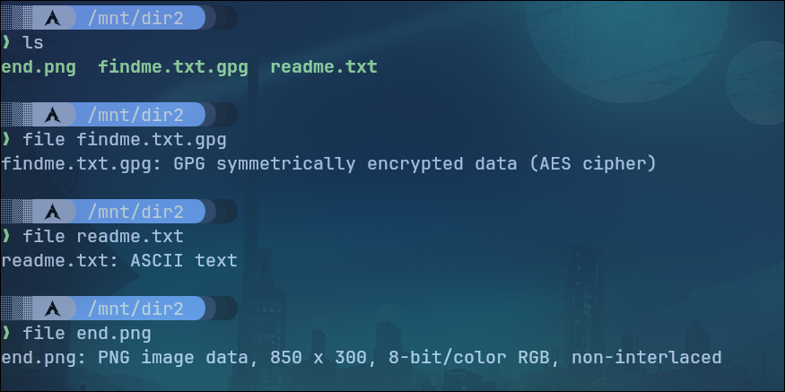

On retrouve 3 fichiers à l'intérieur dont celui que nous pouvons déchiffré avec la clé gpg.

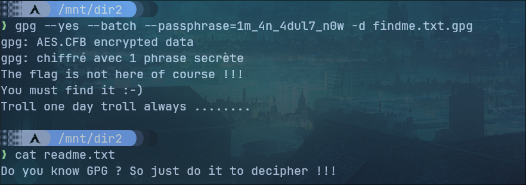

Ces deux fichiers textes ne donnent aucune informations concrète, je me concentre donc sur l'image.


A première vu l'image ne contient pas d'informations importantes. Il faut regarder si elle ne contient pas d'autres fichiers avec binwalk:

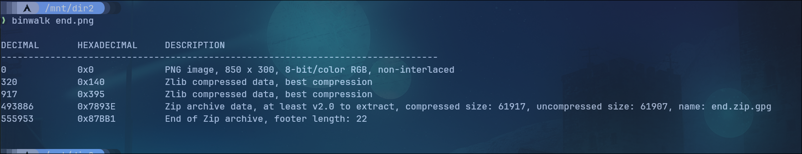

L'image contient bien d'autres fichier et notamment le fichier end.zip.gpg dont nous connaissons le mot de passe.

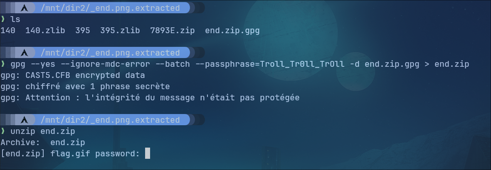

Le zip est protégé par un mot de passe. Après avoir tenté un attaque par dictionnaire avec la liste rockyou.txt, cette dernières n'a pas fonctionné. Cependant, je me suis souvenu qu'un dictionnaire avait été créer sur la machine avant d'être supprimé. Comme linux ne supprimé que le lien vers le fichier lors qu'un rm, le fichier est toujours présent dans le disque. J'utilise le logiciel photorec pour récupérer les fichiers supprimés sur la partition montée:

Proceed > Entrée
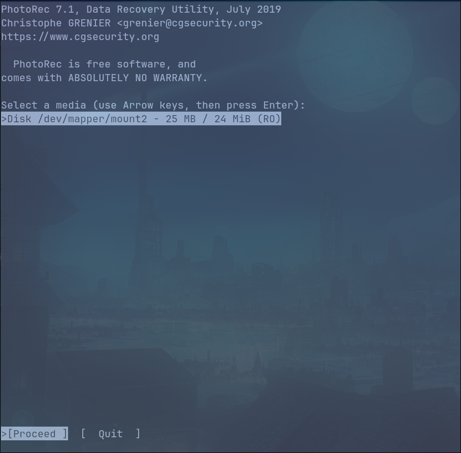

Entrée
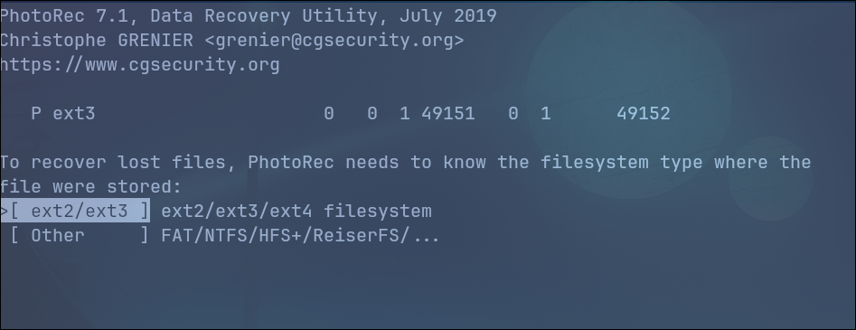

Entrée
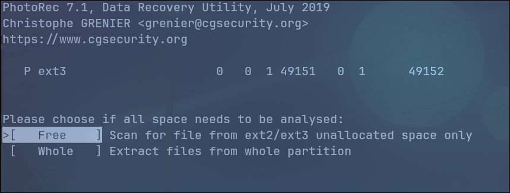

Je selectionne le répertoire dans lequel je veux récupérer le fichier et j'appuie sur C.
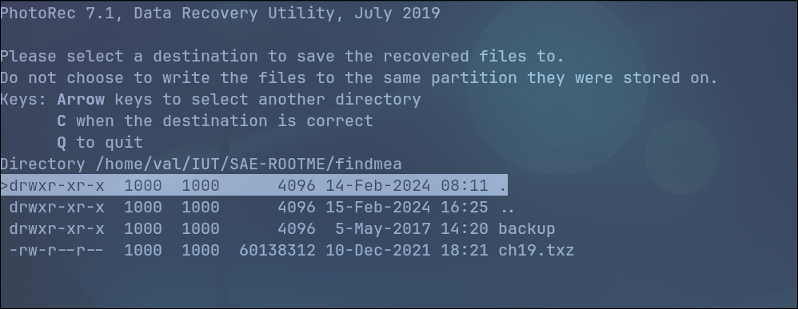

Un fichier a été récupéré.
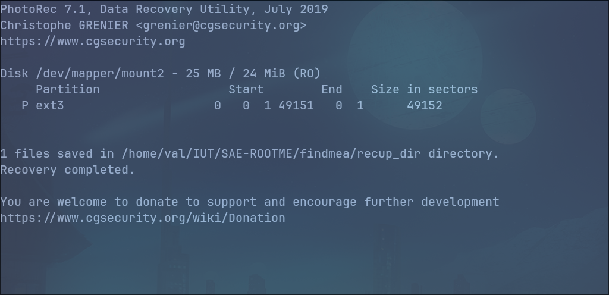

Le fichier récupéré semble être le dictionnaire de mot supprimé, je vais faire une attaque avec ce dernier sur le end.zip.
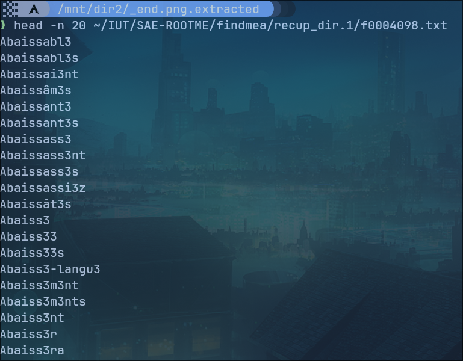

On trouve le mot de passe **Cyb3rs3curit3**, on va pouvoir extraire le fichier flag.gif contenu dans l'archive.
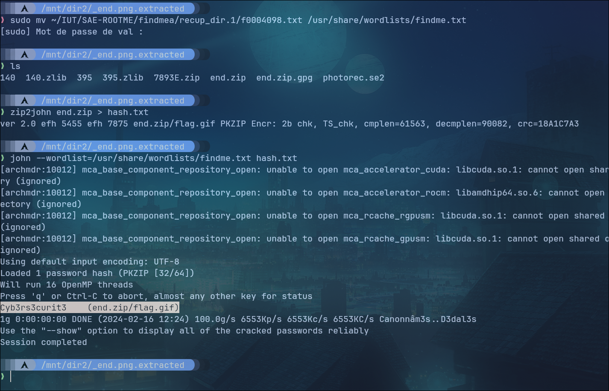

Le fichier contient une série de QR Code qui défile en boucle.
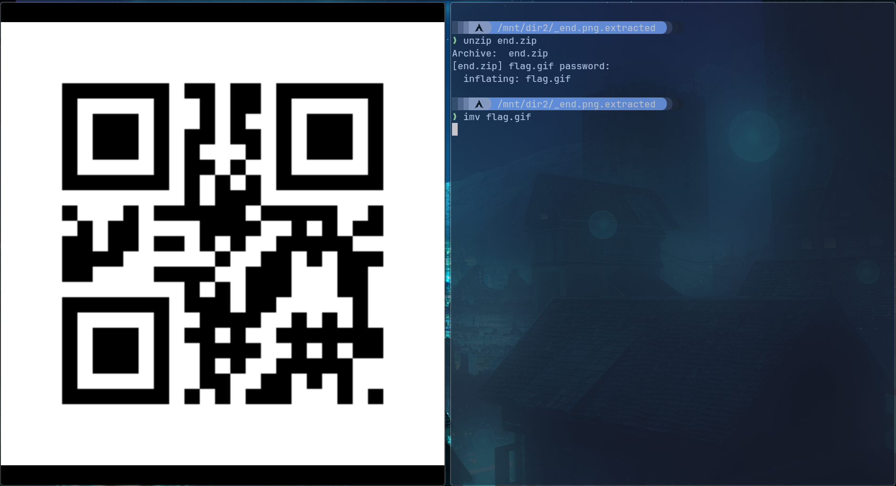

En regardant avec le lecteur de QR Code de mon téléphone je remarque que chaque QR Code donne une lettre différente. Je décide alors de faire un script Python pour extraire les informations des QR code contenus dans chaque frame du gif.

```python
#!/usr/bin/python3
from PIL import Image
import qrtools
import os

gif = Image.open("./flag.gif")
qr = qrtools.QR()
flag=""
for i in range(gif.n_frames):
    gif.seek(i)
    gif.save(f"{i}.png")
    qr.decode(f"{i}.png")
    flag=flag+qr.data
    os.remove(f"{i}.png")

print(flag)
```
é
En exécutant le programme j'obtiens le flag: ```1_Lik3_F0r3nS1c_4nd_y0u?```

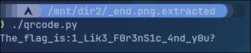