# SAE6C01 - Root-me Find me back

On a un dump mémoire et une image disque correspondant à un appareil Apple, surement MAC OS X.
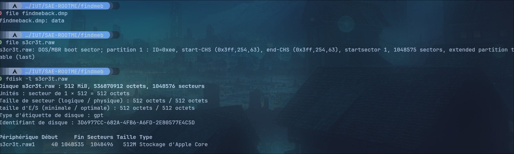

Avec volatility il faut donc ajouter un profil correspondant à la version de Mac OS du PC, je cherche la version.

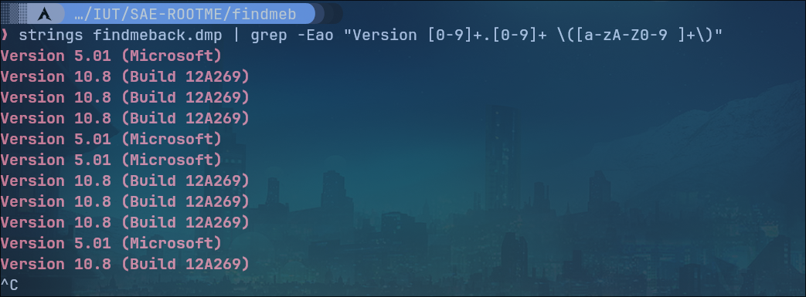

Il s'agit de la version 10.8 de MacOS, un profile est trouvable sur le répository officiel de volatility: <https://github.com/volatilityfoundation/profiles/tree/master/Mac/10.8/x64>

Je peux donc commencer à analyser le dump mémoire.

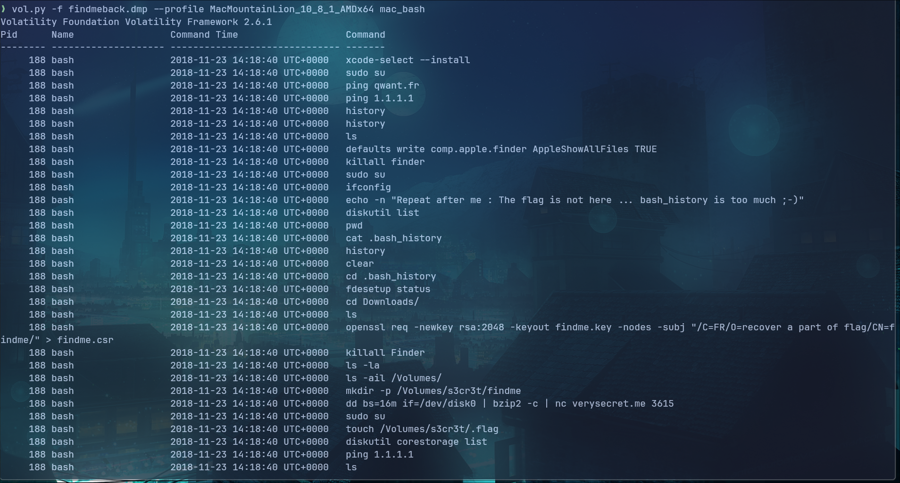

Il semble ne rien n'y avoir d'interessant dans l'historique de commande mac.

Je récupère les notes contenus dans l'appareil.

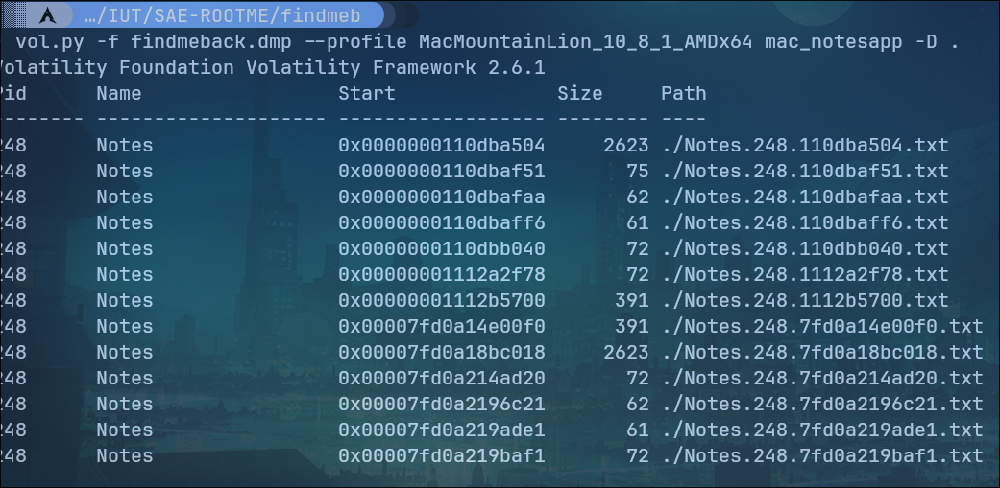

Chaque notes constitue un morceau de page html, je decide de recostitué la page.

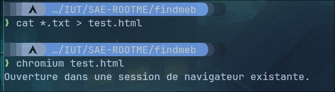

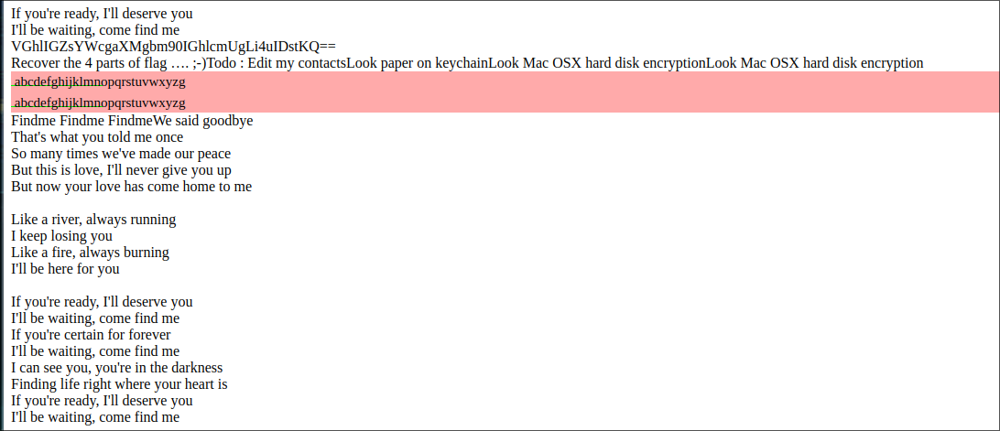

Il y a écrit de regarde les contacts, la keychain et "Mac OSX hard disk encryption".

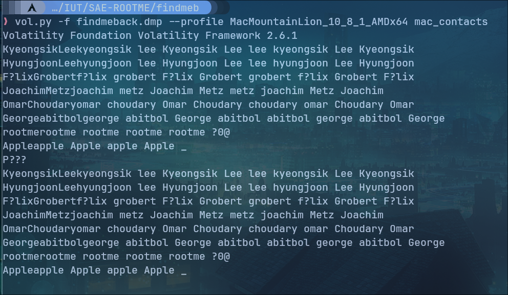

Je ne vois rien d'interessant dans les contacts, je me penche vers la keychain.

Je récupère le fichier login.keychain
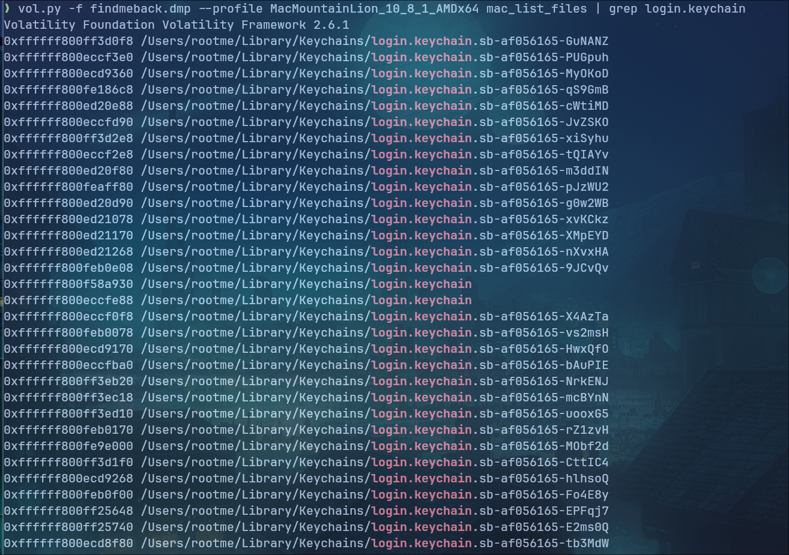

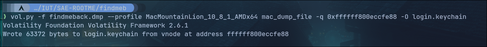

Je récupère les clés keychain stockés dans la mémoire.

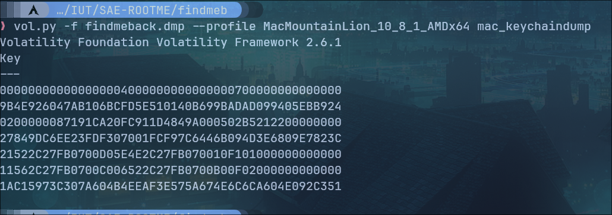

Les clés peuvent être utile pour dévérouiller la keychain. J'utilise l'outils chainbreaker pour dévérouiller cette dernière.

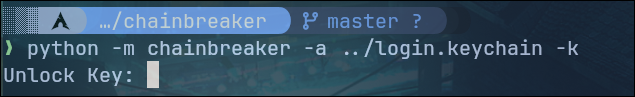

Après avoir essayé avec plusieurs clés, la dernières est celle qui fonctionnait. (1AC15973C307A604B4EEAF3E575A674E6C6CA604E092C351)

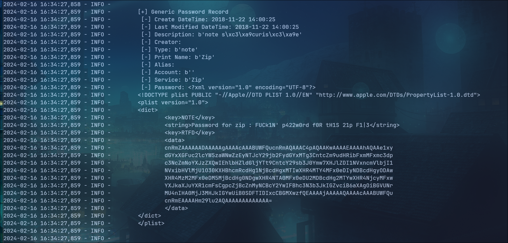

La keychain contient des informations interessantes comme des mot de passes.

J'ai ensuite essayé de monter le volume s3cr3t.raw avec les mot de passe trouvés, il faut donné en argument l'offset de la partition. Comme cette dernière commence au secteur 40, l'offset est égale à 40 fois la taille d'un secteur (512) soir 20480

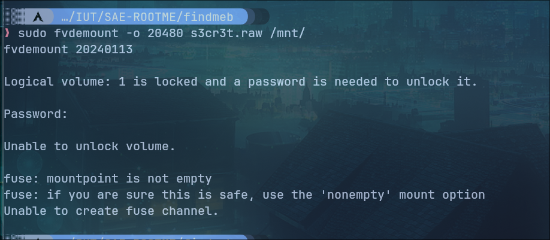

Aucun des mots de passe trouvés n'a fonctionnait.