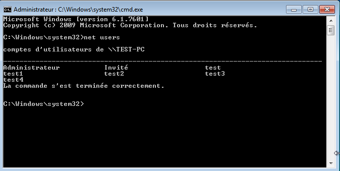

# SAE6C01 - Image mémoire

J'ai installé une machine virtuelle sous Windows 7 pour réaliser cet exercice.

## 2. Création des utilisateurs locaux

J'ai crée les utilisateurs suivants:

## 3. Vérification de la liste des utilisateurs

Les utilisateurs crées sont bien présent dans la liste des utilisateurs locaux de la machine.

## 4. Image locale de la machine avec FTK Imager

Pour réaliser une image mémoire on va dans File > Capture Memory

On donne le nom de la capture de RAM et on lance cette dernière. On obtient le fichier win7.mem qu'il faut maintenant exporter sur la machine Linux afin d'utiliser volatility.

## 5. Verification avec Volatility

On indentifie le profile à utilisé:

On utilisera le profile Win7SP1x64 afin de récupérer le hashdump la machine:

On verifie avec crackstation que le hash NTML des utilisateurs correspond bien au mot de passe des utilisateurs crée (Ils ont tous le mot de passe **passw0rd** (comme montrer sur la capture en partie 2) sauf test qui a le mot de passe **test**).

Les hash NTML correspondent bien au mot de passe des utilisateurs.