# R6C01 - ROASTME

## Analyse du dump mémoire

On a commencé par analyser le dump mémoire avec volatility 2.6.1 et on se rend compte après plusieurs utilisations que le profile n'est pas le bon, nous n'avons pas pu extraire de fichier. Nous avons décidé d'utiliser volatility3 pour contourner le problème de profile.

### Analyse des processus

```bash
python3 vol.py -f ../cbdump.mem windows.pslist
```

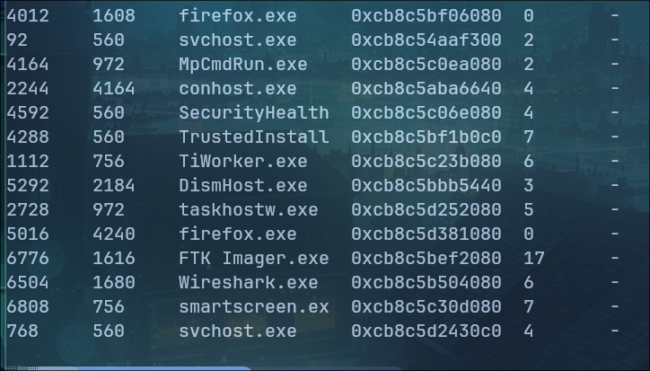

On remarque qu'il y a plusieurs processus firefox.exe de lancé ainsi que Wireshark.exe.

En cherchant dans l'historique de commande, on se rend compte que Wireshark est utilisé pour lire une capture de trame en .pcap stocké sur l'ordinateur.

```bash
python3 vol.py -f ../cbdump.mem windows.cmdline
```

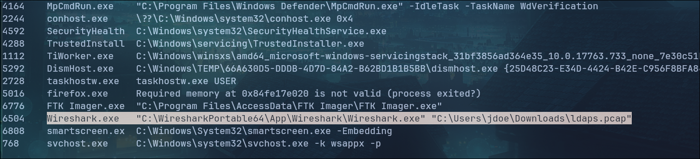

### Récupération de fichiers

On recherche alors avec filescan s'il y a d'autres fichiers dans le répertoire Downloads de l'utilisateur jdoe.

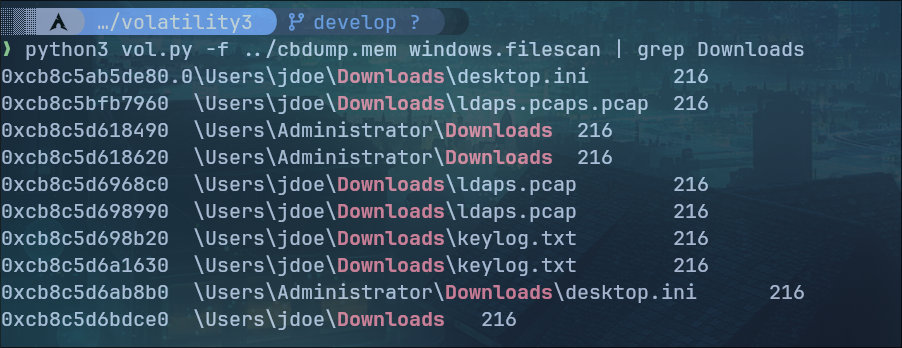

Il y a bien le fichier pcap qui est ouvert dans wireshark ainsi qu'un fichier **keylog.txt** qui semble intéressant. Nous allons donc récupérer ces 2 fichiers.

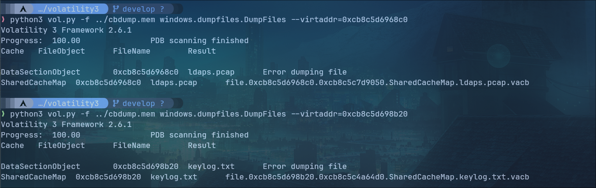

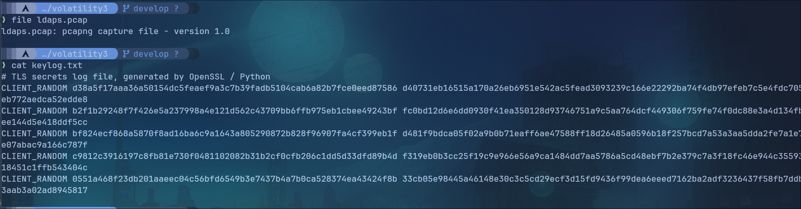

Le fichier pcap est bien une capture de trame, le fichier keylog.txt contient des clés TLS.

### Analyse de la capture de trame

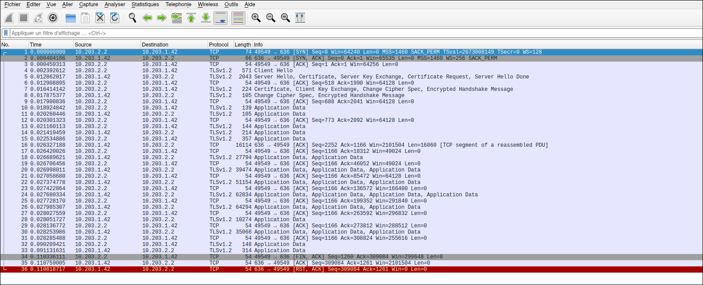

La capture contient des échanges TCP chiffrés par TLSv1.2, on ne peut donc pas accéder au contenu des trames. Cependant, il est possible de charger les clés récupérées dans le fichier keylog.txt pour tenter de déchiffrer le trafic directement sur wireshark.

On va dans **Edit>Preferences>Protocols>TLS** puis on ajoute le fichier keylog.txt dans (Pre)-Master-Secret log filename.

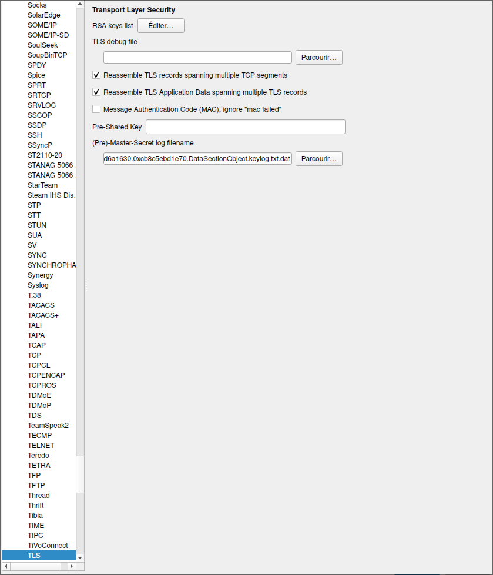

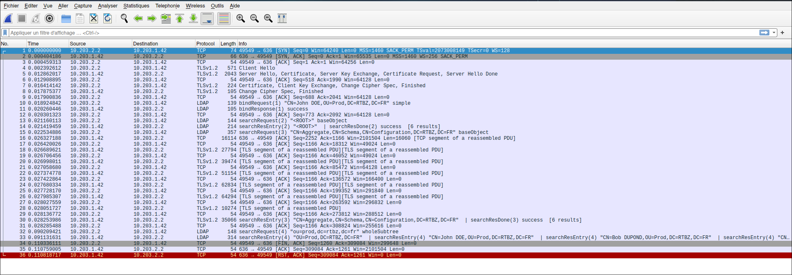

Le trafic TLS est déchiffré, on peut voir les échanges LDAP en clair. En suivant le flux TLS on s'aperçoit que l'on obtient un mot de passe en clair.

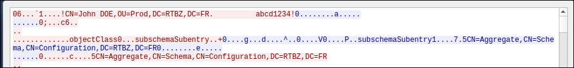

On a donc le mot de passe de l'utilisateur jdoe qui est ```abcd1234!```.
Après avoir scanné la machine avec nmap, nous avons remarqué que le port 3389 était ouvert ce qui signifie que nous pouvons nous connecter en RDP sur la machine.

### Connexion à la machine avec l'utilisateur jdoe

En arrivant sur la machine avec l'utilisateur, nous trouvons dans le répertoire de personnel (C:\Users\jdoe) le 1er flag (flag1.txt)

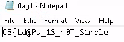

Nous décidons de lancer le logiciel Sharphound sur la machine pour cartographier les différents éléments présents sur l'Active Directory et le réseau dans bloodhound.

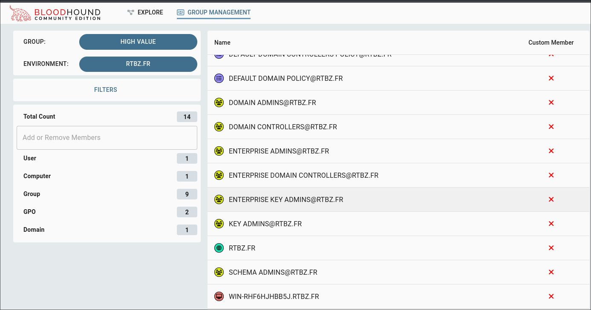

### Analyse avec Bloodhound

Sur ce réseau, il n'y a qu'une seule machine, celle sur laquelle nous sommes connectés, c'est donc le DC de l'Active Directory. On remarque avec bloodhound que sur cette machine, 3 utilisateurs sont autorisés à se connecter en RDP sur la machine:

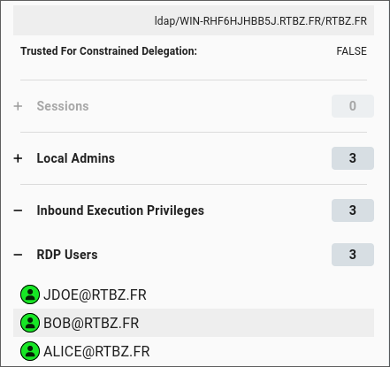

Il y a les utilisateurs jdoe, bob et alice.

### Kerberoast

Nous avons dans un premier temps tenté d'utiliser Mimikatz pour obtenir plus de droits sur la machine, mais ne possédant pas de droit de base il était impossible de lancer une attaque avec ce programme.

En relisant le nom du challenge "ROASTME" nous avons pensés à utiliser l'attaque Kerberoast et voir si un utilisateur était vulnérable.

Nous avons utilisé l'outil Rubeus pour effectuer cette attaque.

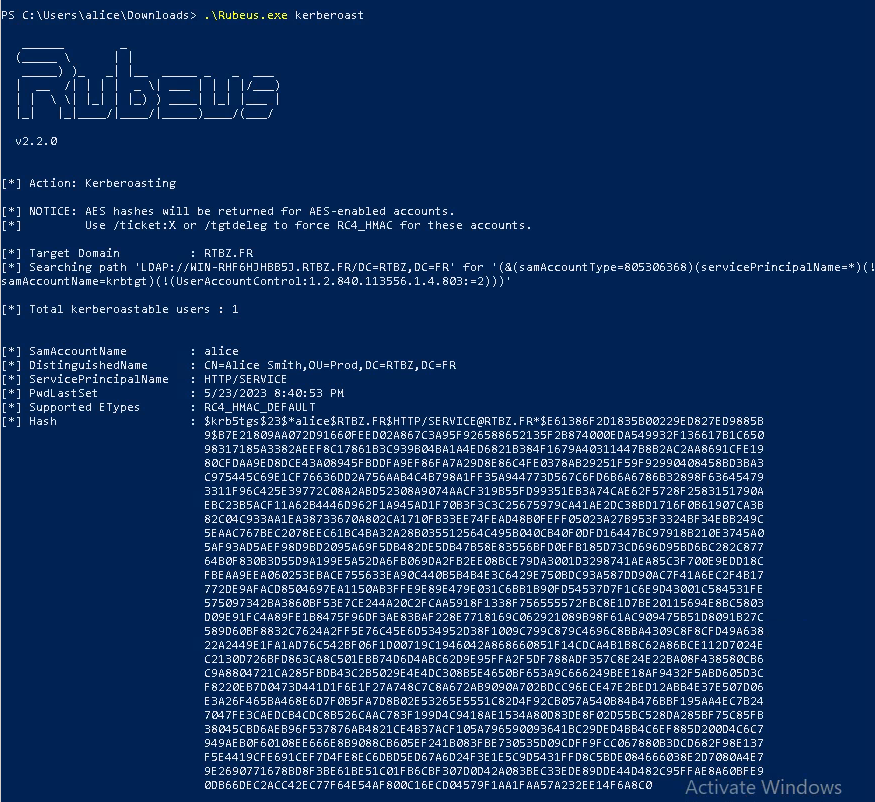

On parvient à récupérer un hash, l'utilisateur Alice était vulnérable à cette attaque.

On exporte le hash sur notre machine linux pour effectuer une attaque par dictionnaire avec John sur ce dernier.

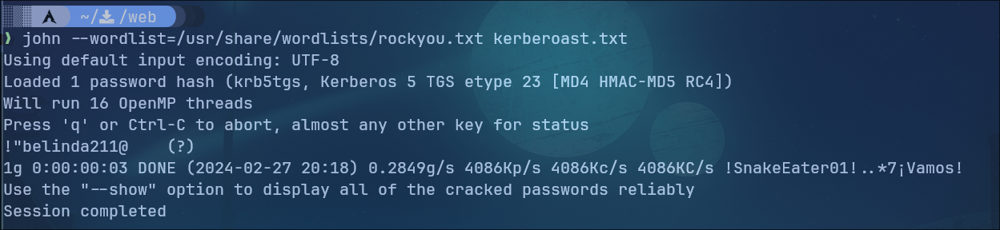

On obtient le mot de passe ```!"belinda211@``` qui est le mot de passe d'Alice.

### Connexion à la machine avec l'utilisateur Alice

Une fois sur la machine avec l'utilisateur Alice, on retrouve dans le dossier personnel le 2ème flag (flag2.txt).

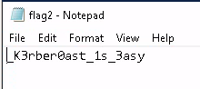

### ASREProast

En restant dans les attaques "roast" nous remarquons avec Rubeus qu'il est possible de faire une attaque **asreproast**, nous allons donc voir si un utilisateur est vulnérable.

Cependant, lors de l'attaque avec Rubeus nous remarquons qu'il y a un problème au niveau du LDAP et que l'attaque n'est pas possible. Nous avons donc essayé de faire l'attaque grâce à **Impacket**.

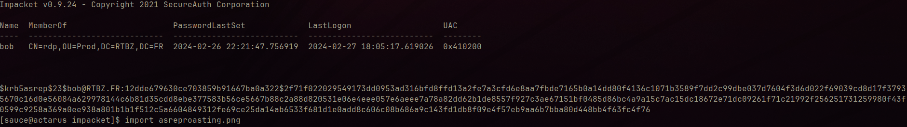

On récupère bien un hash pour l'utilisateur Bob. On l'exporte sur une machine linux pour l'attaquer avec John.

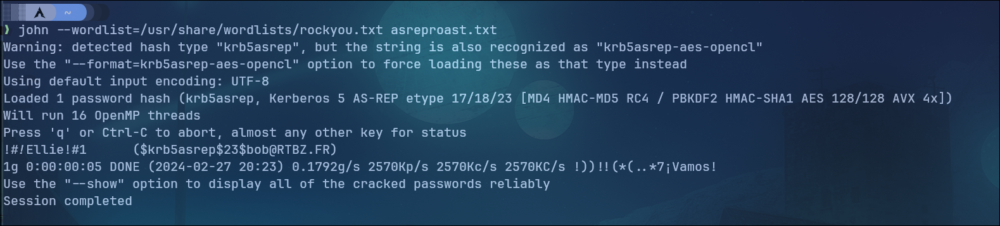

On obtient bien le mot de passe de l'utilisateur Bob qui est ```!#!Ellie!#1```.

### Connexion à la machine avec l'utilsateur Bob

Encore une fois, dans le répertoire personnel de l'utilisateur, on trouve la dernière partie du flag.

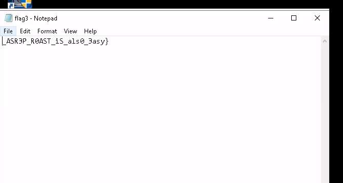.

On obtient donc le flag complet qui est: ```CB{Ld@Ps_1S_n0T_S1mple_K3rber0ast_1s_3asy_ASR3P_R0AST_iS_als0_3asy}```.
