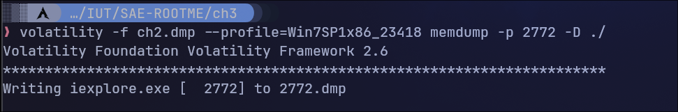
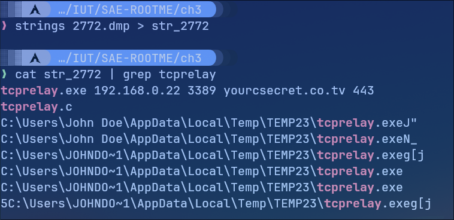

# ROOT-ME - Command & Control niveau 4

J'ai trouvé au niveau 3 le processus qui cachait le virus. C'était le programme au PID **2772** qui executait un programme cmd.exe (PID 1616) qui executait ensuite une connexion vers l'extérieur avec un programme nommé **tcprelay.exe**.

## Dump mémoire du virus

Dans un premier temps, je fais un dump de la mémoire du fichier afin d'analyser les strings du fichier par la suite (les informations contenu dans un fichier qui n'est pas un fichier texte).

## Analyse des strings du dump mémoire

On sait que le virus ouvrez une connexion grâce au programme tcprelay donc on va chercher s'il y a dans les strings le nom de tcprelay.

On trouve bien l'adresse IP et le port, ici **192.168.0.22:3389** c'est le mot de passe du channel.
