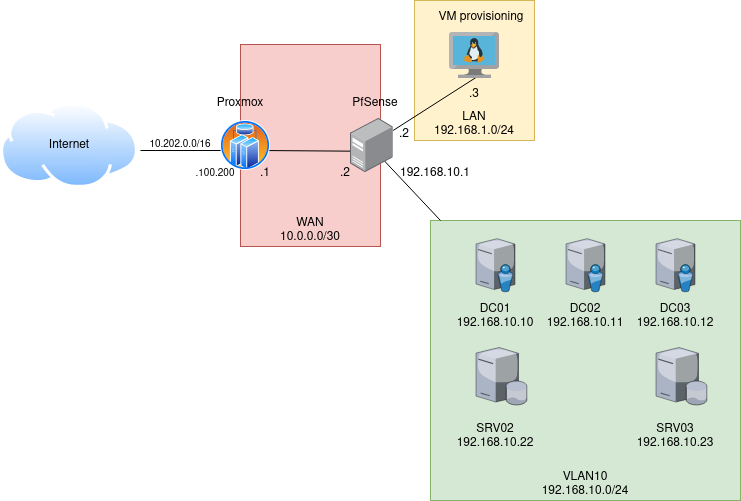
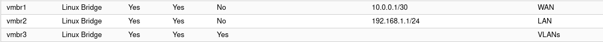
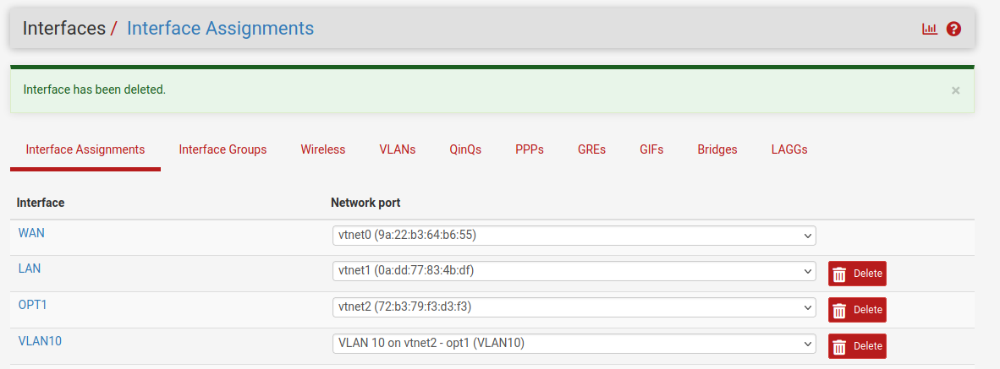
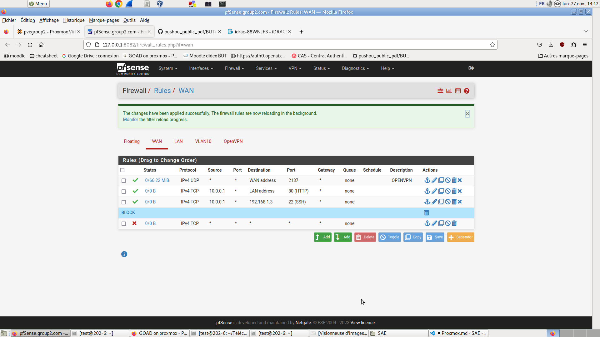
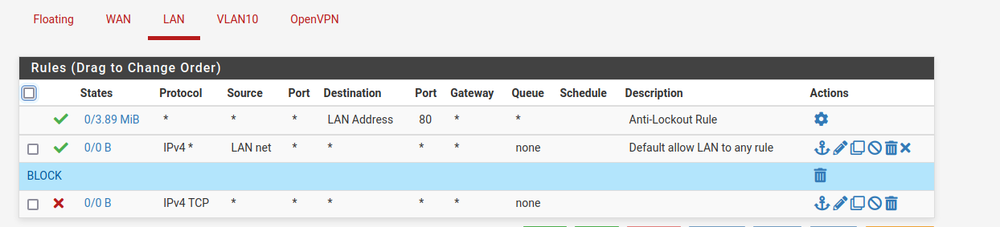
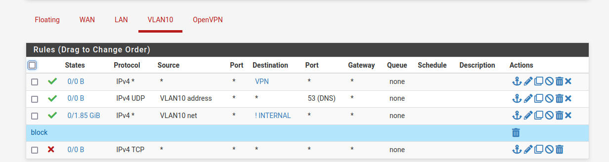
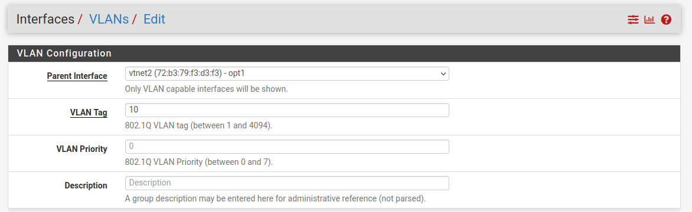
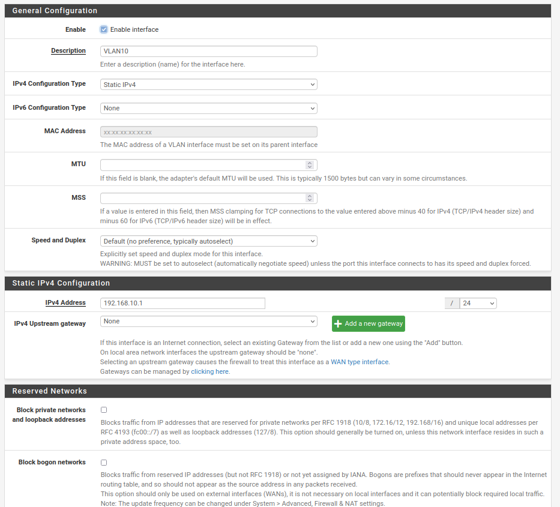
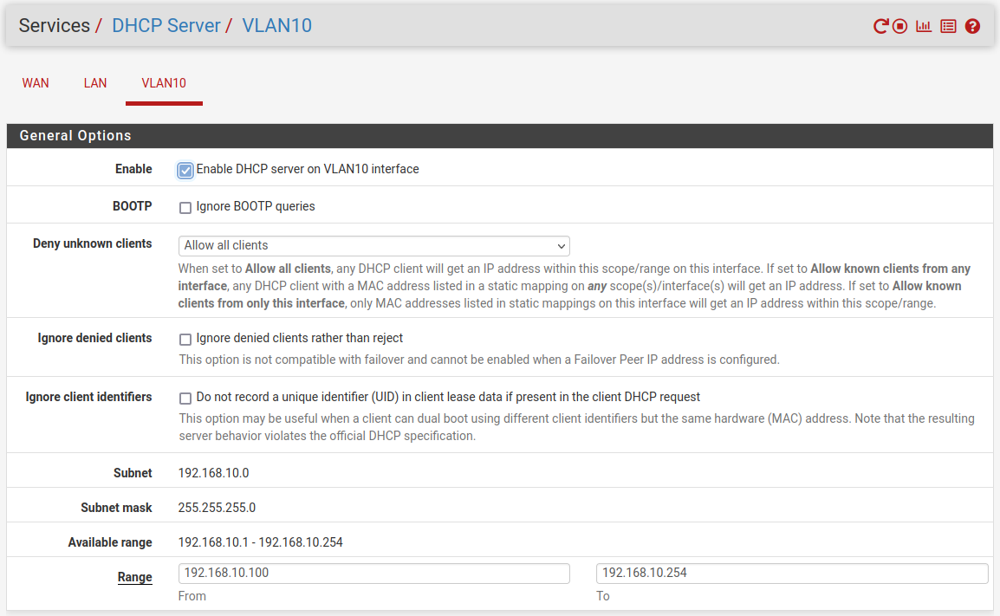
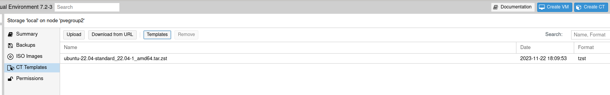

Valentin Tugot
# Installation GOAD sous proxmox

Après l'installation le schéma du réseau est le suivant:



Les différentes installations suivantes ont été effectués après l'installation de proxmox (version 7.2) sur un serveur de la salle.

## 1. Installation de pfSense

L'utilisation de pfSense permet d'avoir un pare-feu virtuel qui nous permet de gérer la connexion entre notre proxmox et l'environnement GOAD tout en ayant de la sécurité et différents services utiles tel que le DHCP ou le DNS.<br>
Le pare-feu pfSense permettra également d'accéder au machine de GOAD avec un accès OpenVPN.
<br>

Dans un premier temps il faut configurer 3 bridges sur le proxmox pour réaliser les différents réseau (WAN, LAN, VLAN10):


<br>

Une fois les bridges crée, il faut créer la VM avec pfSense.<br>
J'ai récupéré l'iso pfsense sur le site officiel, j'ai importé l'iso sur proxmox puis j'ai crée la VM.<br>
Afin d'accéder au pare-feu, on se connecte en SSH sur le proxmox en faisant un forward de l'IP du pfSense sur un port de ma machine locale avec la commande suivante:
```bash
ssh -L 8082:192.168.1.2:80 root@10.202.100.200
```

### Configuration des interfaces

Une fois la VM installé j'ai configuré les interfaces du pare-feu:
<br>
J'ai assigné chaque interface du pare-feu à un bridge du proxmox crée précedemment




Pour les interfaces, l'adressage est le suivant:
- WAN: 10.0.0.2/30
- LAN: 192.168.1.2/24
- VLAN10: 192.168.10.1/24

### Configuration du filtrage

Pour les règles de filtrage, on applique par défaut une règle qui bloque tout les paquets et on autorise seulement le trafic utile au fonctionnement de notre installation. <br>

__Interface WAN:__



Pour l'interface WAN on ajoute 3 règles:
- L'accès au VPN sur le port 2137
- L'accès au l'interface pfSense en SSH
- Et en HTTP
<br>

__Interface LAN:__



Pour l'interface LAN on configure 1 règles (la 1ère règles et configuré automatiquement par pfSense). La règle à ajouter permet aux machines sur le réseau LAN d'accèder à Internet et à tout les autres services.
<br>

__Interface VLAN10:__



Sur l'interface du VLAN les 3 règles ajoutés permettent:
- D'autoriser le trafic entrant sur le VPN
- D'autoriser les machines sur le VLAN d'accéder au DNS (UDP/53)
- D'autoriser le trafic des machines du VLAN10 vers les machines du réseau LAN et du VLAN10 entre elles.
<br>

Afin que les machines puissent d'accéder à internet il faut aussi configurer certaines règles sur le proxmox directement via SSH avec les commandes suivantes:

```bash
# Activer le routage
echo 1 | sudo tee /proc/sys/net/ipv4/ip_forward
# Autorise l'ICMP
iptables -t nat -A PREROUTING -i vmbr0 -p icmp -j ACCEPT
# Autorise le SSH
iptables -t nat -A PREROUTING -i vmbr0 -p tcp --dport 22 -j ACCEPT
# Autorise l'accès au Proxmox sur le WEB
iptables -t nat -A PREROUTING -i vmbr0 -p tcp --dport 8006 -j ACCEPT
# Redirection de tout le trafic sur le pfsense
iptables -t nat -A PREROUTING -i vmbr0 -j DNAT --to 10.0.0.2
# Source NAT sur l'IP de la salle
iptables -t nat -A POSTROUTING -o vmbr0 -j SNAT -s 10.0.0.0/30 --to-source 10.202.100.200
```

### Configuration du VLAN10

On configure dans un premier temps l'interface sur le bon bridge et on donne le Tag du VLAN:



Ensuite, on configure l'IP pour ce VLAN:


<br>

Enfin, on configure un server DHCP pour le VLAN afin d'adresser les machines Windows durant leurs installations.



## 2. Provisioning

On va déployer un container linux à l'aide des CT Templates de proxmox. Pour cela, on se rends dans l'onglet CT Template, on recupère une template Ubuntu depuis l'onglet Templates en haut. Une vois la template Ubuntu téléchargé, on peut cliquer en haut à droite sur "Create CT".


<br>

Pendant la création du Container, il faudra configurer son IP sur le bridge vmbr2 avec une IP sur le réseau LAN (192.168.1.0/24), la gateway sera 192.168.1.2. On peut également ajouter une clé SSH directement pendant la configuration sur proxmox.
<br>

Une fois le container crée, on va installer les paquets et les logiciels requis à l'installation de GOAD sur le proxmox:

__Installation des paquets utiles__

```bash
sudo apt update && apt upgrade

sudo apt install git vim tmux curl gnupg software-properties-common mkisofs
```
<br>

__Installation de Packer__

Packer va servir à créer des templates des serveurs que nous allons déployer (Windows 2016 et 2019).

```bash
#Ajout du répository de packer et de sa signature
curl -fsSL https://apt.releases.hashicorp.com/gpg | apt-key add -
sudo apt-add-repository "deb [arch=amd64] https://apt.releases.hashicorp.com $(lsb_release -cs) main"
sudo apt update && apt install packer
```
<br>

__Installation de Terraform__

Terraform va permettre de créer directement les VM sur le proxmox à partir d'un fichier de configuration et des templates créés par Packer.

```bash
# Installation de la signature d'Hashicorp.
wget -O- https://apt.releases.hashicorp.com/gpg | \
gpg --dearmor | \
tee /usr/share/keyrings/hashicorp-archive-keyring.gpg

# Verifie l'empreinte de la signature.
gpg --no-default-keyring \
--keyring /usr/share/keyrings/hashicorp-archive-keyring.gpg \
--fingerprint

# Ajoute la sourcelist de terraform
echo "deb [signed-by=/usr/share/keyrings/hashicorp-archive-keyring.gpg] \
https://apt.releases.hashicorp.com $(lsb_release -cs) main" | \
tee /etc/apt/sources.list.d/hashicorp.list

# Installe terraform
apt update && apt install terraform
```
<br>

__Installation d'Ansible__

Une fois les VM créées par Terraform, on va utiliser Ansible afin de les configurer avec les bons domaines Active Directory, les bonnes configuration réseau et les bons services installés.

```bash
apt install python3-pip
python3 -m pip install --upgrade pip
python3 -m pip install ansible-core==2.12.6
python3 -m pip install pywinrm
```
<br>

## 3. Création des templates avec Packer

Dans un premier temps, il faut télécharger les iso Windows 2016 et les mettres sur le proxmox via la fonctionnalité "Download from URL", voici les liens pour télécharger les iso:
- [Windows Server 2016](https://software-download.microsoft.com/download/pr/Windows_Server_2016_Datacenter_EVAL_en-us_14393_refresh.ISO)
- [Windows Server 2019](https://software-download.microsoft.com/download/pr/17763.737.190906-2324.rs5_release_svc_refresh_SERVER_EVAL_x64FRE_en-us_1.iso)
<br>

__Téléchargement de cloundbase-init__

Cloudbase-init est un outil qui permet de lancer sur chaque VM Windows un service qui va récupérer les configuration du serveur proxmox afin de paramétrer Windows (comme l'ip par exemple).

```bash
cd /root/GOAD/packer/proxmox/scripts/sysprep
wget https://cloudbase.it/downloads/CloudbaseInitSetup_Stable_x64.msi
```